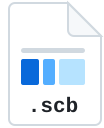
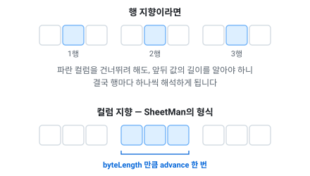

# 바이너리 형식 — 컬럼 지향과 스키마 진화

> [문서 목록으로](../readme.md)

런타임 데이터 파일(`.scb`)의 형식과, 스키마가 바뀌었을 때 무엇이 보장되는지를 적습니다. 이 형식을 쓰는 이유(파싱이 없다·인코딩이 값 크기에 맞는다·값이 변하지 않는다)는 [내보내기](exports.md#왜-바이너리인가)에 있습니다.



**확장자는 `.scb` — SheetMan Compiled Binary의 약자입니다.** 시트를 컴파일한 결과라는 뜻이고, 위 아이콘이 그리는 것이 그 안에 든 것입니다 — 행이 아니라 컬럼별로 모인 값 블록, 그리고 그 앞에서 각 블록의 길이를 먼저 말하는 디스크립터.

확장자는 익스포터와 테이블 리더 양쪽에서 recipe로 바꿀 수 있으므로(`FileExtension`·`BinaryTableFileExtension`, [설정](recipe.md#내보내기)), 유니티처럼 확장자를 가리는 곳에서는 `.bytes`로 둡니다. 안에 든 바이트는 파일 이름과 무관하게 같습니다.

**바이트 순서는 리틀엔디안입니다.** 고정폭 값(`fixed32`, `fixed64`)은 항상 리틀엔디안으로 기록되고, 테이블 리더는 호스트의 순서가 아니라 그 순서로 해독합니다 — 빅엔디안 기기에서 읽어도 같은 값이 나옵니다. varint는 낮은 7비트부터 나가므로 정의상 리틀엔디안이고, `uuid`만 예외적으로 .NET `Guid` 배치(앞 세 구성요소는 리틀엔디안, 뒤 8바이트는 그대로)를 따릅니다.

**형식 버전은 하나뿐입니다.** 파일 머리의 버전 정수가 테이블 리더가 아는 값과 다르면 그 자리에서 멈춥니다. 옛 배치로 가는 호환 경로는 없고 만들 계획도 없습니다 — 이 빌드가 못 읽는 파일은 해석할 파일이 아니라 다시 뽑을 파일입니다.

## 어디서 가져온 아이디어인가

**구글 프로토콜 버퍼의 와이어 포맷입니다.** 값 인코딩은 거의 그대로 가져왔습니다.

|가져온 것|프로토버프에서|
|--|--|
|바이트당 7비트를 낮은 자리부터 쓰고, 더 있으면 최상위 비트를 세우는 varint|[Base 128 Varints](https://protobuf.dev/programming-guides/encoding/#varints)|
|부호를 접어 작은 음수도 짧게 만드는 지그재그|[Signed Integers](https://protobuf.dev/programming-guides/encoding/#signed-ints)|
|varint로 손해인 값은 고정폭으로 쓴다는 구분(`fixed32`·`fixed64`)|[Non-varint Numbers](https://protobuf.dev/programming-guides/encoding/#non-varints)|
|길이를 앞에 적어 내용은 몰라도 건너뛸 수 있게 하는 방식|[Length-Delimited Records](https://protobuf.dev/programming-guides/encoding/#length-types)|
|**모르는 필드를 건너뛸 수 있으면 스키마가 바뀌어도 읽을 수 있다**는 wire type 개념 자체|[Message Structure](https://protobuf.dev/programming-guides/encoding/#structure)|

바꾼 것은 **그 태그를 어디에 붙이느냐** 하나입니다. 프로토버프는 값마다 붙이고, 이 형식은 **컬럼마다 한 번** 붙입니다 — 정적 테이블의 행은 동종이라 스키마를 행 수만큼 반복할 이유가 없기 때문입니다. 그 차이를 [레이아웃](#레이아웃)에 적었습니다. 프로토버프가 주는 것 중 정적 테이블에 필요 없는 것 — 임의 깊이의 중첩 메시지, `oneof`, 맵 — 은 아예 넣지 않았습니다.

전체 인코딩 규격은 [Protocol Buffers — Encoding](https://protobuf.dev/programming-guides/encoding/)에 있습니다. 이 문서의 「[값 인코딩](#값-인코딩)」과 나란히 읽으면 무엇이 같고 무엇이 다른지 바로 보입니다.

---

## 무엇을 푸는 형식인가

행 지향이고 스키마가 파일에 없으면, 테이블 리더는 **생성 시점에 알던 순서 그대로** 읽는 수밖에 없습니다. 그러면 컬럼을 추가하든 지우든 순서를 바꾸든 테이블 리더는 한 칸 밀리고 그 뒤 전부가 어긋납니다 — 실패가 아니라 **조용히 다른 값**입니다.

클라이언트와 데이터를 **항상 함께** 배포한다면 문제가 없습니다. 문제는 그렇게 못 하는 흐름입니다.

- CDN에 데이터만 올려 패치하는 경우
- 스토어 심사 중이거나 업데이트를 미룬 **구버전 클라이언트**가 새 데이터를 받는 경우
- 데이터만 롤백해서 **신버전 클라이언트**가 옛 데이터를 받는 경우

이 형식의 불변식은 하나입니다: **어떤 스키마 변경도 조용한 오독이 되지 않습니다.** 읽을 수 있으면 정확히 읽고, 읽을 수 없으면 필드 이름과 양쪽 타입을 짚어 멈춥니다.

## 레이아웃

핵심 결정은 **행 지향이 아니라 컬럼 지향**입니다. 컬럼마다 값이 연속 블록이고 그 블록의 바이트 길이가 헤더에 있으므로, **모르는 컬럼 건너뛰기 = `advance(길이)` 한 번**입니다. 타입별 스킵 로직이 없으니 13개 테이블 리더가 각자 다르게 틀릴 자리도 없습니다.



이게 왜 중요하냐면, 테이블 리더가 **자기가 만들어진 뒤에 추가된 컬럼**을 만나는 일이 실제로 생기기 때문입니다. 그때 할 일이 「길이만큼 건너뛴다」 하나로 끝나야 합니다.

프로토버프처럼 값마다 태그를 달면 스키마 정보가 행 수만큼 반복됩니다. 정적 테이블의 행은 동종이라 그럴 이유가 없습니다 — 로컬라이제이션 20,000행 × 8칸이면 값별 태그는 **156 KB**, 테이블 디스크립터는 **56 B**입니다.

```
fixed32    version        = 101
fixed8     flags          = 0        (예약: 압축·암호화. 0이 아니면 테이블 리더가 거절)
counter32  rowCount
counter32  columnCount
columnCount ×:                        ── 디스크립터 ──
  counter32  tag                      1 이상, 테이블 내 유일
  fixed8     wire                     하위 4비트 = 원소 타입, 5~6비트 = 종류, 7~8비트 = 예약(0)
  counter32  count                    스칼라 = 1, 고정배열 = N, 가변배열 = 0
  fixed32    byteLength               이 컬럼 블록의 총 바이트
columnCount ×:                        ── 데이터 ──
  블록: rowCount개의 값
```

디스크립터는 컬럼당 **7바이트**(태그와 count가 1바이트로 끝나는 보통의 경우)이고, **테이블당 한 번**입니다. 행이 늘어도 늘지 않습니다.

`byteLength`만 `counter32`가 아니라 `fixed32`입니다. writer가 블록을 다 쓴 뒤 그 자리로 돌아가 값을 채우는데(backpatch), varint는 길이가 값에 따라 달라져서 되채울 수 없기 때문입니다.

### 실제 파일 한 개, 전부

`SecondTable`(1행 3컬럼, 42바이트)입니다. 이 바이트열은 테스트에 그대로 박혀 있습니다 — [검증 게이트](#검증-게이트)의 형식 고정 항목.

```
65 00 00 00   version 101
00            flags
02            rowCount    counter32, 지그재그 2 → 1
06            columnCount counter32, 지그재그 6 → 3

02            tag 1
02            wire: 원소 i32(2), 종류 스칼라(0)
02            count 1
04 00 00 00   byteLength 4

04            tag 2
06            wire: 원소 string(6), 종류 스칼라(0)
02            count 1
06 00 00 00   byteLength 6

06            tag 3
02            wire: 원소 i32(2), 종류 스칼라(0)
02            count 1
04 00 00 00   byteLength 4

01 00 00 00               index 블록: 1
0a 67 61 6d 6d 61         label 블록: 길이 5 + "gamma"
1e 00 00 00               amount 블록: 30
```

### 원소 타입 (wire 하위 4비트)

|값|원소|시트 타입|
|--|--|--|
|0|varint (지그재그)|`enum`|
|1|fixed8|`bool`|
|2|i32 (fixed32)|`int`, `foreign` 인덱스|
|3|i64 (fixed64)|`bigint`, `datetime`, `timespan`|
|4|f32 (fixed32)|`float`|
|5|f64 (fixed64)|`double`|
|6|string (counter32 길이 + UTF-8)|`string`|
|7|bytes16|`uuid`|
|8~15|예약||

i32와 f32는 크기가 같지만 **의미가 다르므로 구분**합니다. 구분하지 않으면 int→double 승격에서 비트 패턴을 잘못 해석합니다.

### 종류 (wire 5~6비트)

|값|종류|블록 내용|
|--|--|--|
|0|스칼라|rowCount개의 원소|
|1|고정 배열 (serial field)|rowCount × count개의 원소|
|2|가변 배열|행마다 `counter32 n` + n개의 원소|

가변 배열의 행별 길이도 블록 **안**이므로 `byteLength`가 전부 덮습니다 — 건너뛰기는 여전히 `advance` 하나입니다.

### 값 인코딩

|이름|인코딩|
|--|--|
|`fixed8`|1바이트|
|`fixed32`|4바이트, **리틀엔디안**|
|`fixed64`|8바이트, **리틀엔디안**|
|`varint32`|바이트당 7비트, 낮은 자리부터. 더 있으면 최상위 비트를 세움. 최대 5바이트|
|`counter32`|지그재그로 부호를 접은 뒤 `varint32`|
|`string`|`counter32` 바이트 길이, 그다음 그만큼의 UTF-8 바이트|
|`uuid`|16바이트, .NET `Guid` 배치|

`float`·`double`은 IEEE-754 비트 패턴을 각각 `fixed32`·`fixed64`로, `datetime`·`timespan`은 .NET 틱(100ns)을 `fixed64`로 씁니다. 어디에 varint를 쓰고 어디에 고정폭을 쓰는지와 그 이유는 [내보내기](exports.md#인코딩이-값의-크기에-맞춰집니다)에 있습니다.

## 테이블 리더의 동작

로드 시작에 한 번 계획을 세우고, 그다음 행 루프는 값을 읽는 것 외에 아무 판단도 하지 않습니다.

1. **헤더와 디스크립터를 읽고, 파일 자신과 대조한다.** 블록은 헤더 뒤에 오는 전부이므로 `byteLength`의 합이 남은 바이트와 **정확히 같아야** 하고, 어느 블록도 행 수보다 짧을 수 없습니다(어느 컬럼이든 한 행이 최소 1바이트). 어긋나면 행을 할당하기 **전에** 멈춥니다 — 손상된 행 수가 20억 행 할당이 되는 경로가 여기서 끊깁니다.
2. **디스크립터마다 태그로 자기 멤버를 찾는다.**
   - **모르는 태그** → `advance(byteLength)`. 신 데이터의 새 컬럼, 또는 코드에서 지운 컬럼.
   - **아는 태그, 모양(종류·count) 불일치** → 필드 이름을 짚어 실패.
   - **아는 태그, 원소가 자기 것이거나 승격 가능** → 그 멤버로 읽는다.
   - **아는 태그, 그 외** → 필드 이름과 양쪽 타입을 짚어 실패.
3. **블록을 다 읽었으면 소비량이 `byteLength`와 같은지 확인한다.** 다르면 형식 불일치이므로, 다음 컬럼을 엉뚱한 바이트에서 읽기 전에 그 컬럼을 짚어 멈춥니다.
4. **파일에 없던 멤버는 기본값 그대로**입니다. 그 기본값은 어느 언어에서도 **널이 아닙니다** — 문자열은 빈 문자열, 배열은 빈 배열, 숫자는 0입니다. 지운 컬럼이 널로 남아 한 필드 뒤에서 크래시하는 것은 답이 아니라 다른 실패입니다.
5. 상호참조 해석은 모든 테이블을 읽은 뒤 한 번에 이뤄집니다.

컬럼 순서는 계약이 아닙니다 — 태그가 식별합니다.

## 타입 변경: 두 지점에서 검사

“wire가 다르면 무조건 실패”는 위험을 테이블 리더에게, 즉 이미 배포된 클라이언트에게 미루는 것입니다. 그래서 두 군데서 봅니다.

### 1. 테이블 리더의 승격 표 — 안전한 변환은 읽는다

수학적으로 무손실인 방향만, 13개 언어가 같은 표 하나를 씁니다.

|파일의 원소|멤버의 원소|판정|근거|
|--|--|--|--|
|varint|i32|**읽음**|지그재그 해독이 곧 int32|
|varint|i64|**읽음**|위와 같음, 더 넓게|
|i32|i64|**읽음**|무손실 확장|
|f32|f64|**읽음**|무손실 확장|
|i32|f64|**읽음**|i32 전 범위가 f64에서 정확|
|그 외 전부|—|**이름 짚어 실패**|손실 가능성이 있으면 읽지 않음|

역방향(i64 파일 → i32 멤버 등)은 **절대 읽지 않습니다.** 잘릴 수 있는 값을 “대개는 맞겠지”로 읽는 것이 이 도구가 계속 없애온 실패 방식입니다.

`datetime`과 `timespan`은 i64지만 **i64만** 받습니다. int 컬럼을 datetime 멤버로 읽는 것은 비트로는 무손실이고 의미로는 틀린 값이므로 승격에서 빠집니다.

이 표가 뜻하는 것: **타입을 넓히는 변경(int→bigint, float→double, enum→int)을 하면 신 코드가 구 데이터를 그대로 읽습니다.** 데이터 롤백과 “클라이언트 먼저 업데이트” 순서가 안전해집니다.

### 2. 변환기의 베이스라인 검사 — 배포 전에 잡는다

승격 표가 못 지키는 방향이 남습니다: **구 클라이언트가 넓어진 새 데이터를 받는 경우**(i64 파일 → i32 멤버). 테이블 리더는 깨끗하게 실패하지만, 라이브에서는 그 깨끗한 실패도 장애입니다. 그래서 **변환 시점에** 잡습니다.

recipe의 `Exports.Binary` 항목에 베이스라인 경로를 적으면 켜집니다. 그 파일은 **커밋하세요** — 지난 스키마의 기록이 비교 대상입니다.

```jsonc
"Binary": [
  {
    "Path": "./build/data",
    "SchemaBaseline": "./schema-baseline.json",
    "AcceptSchemaChanges": []
  }
]
```

매 실행이 스키마를 그 파일과 비교하고, 이미 배포된 테이블 리더가 버티지 못할 변경이면 **아무것도 쓰기 전에** 컬럼 이름과 할 일을 짚어 멈춥니다.

|변경|판정|
|--|--|
|컬럼 추가 (새 태그)|통과. 모르는 테이블 리더는 건너뜁니다|
|이름 변경|통과. 식별자는 태그입니다|
|순서 변경|통과. 파일에서 위치는 의미가 없습니다|
|컬럼 삭제, 시트에 `#이름@태그` tombstone 있음|통과|
|컬럼 삭제, tombstone 없음|**오류.** 태그가 비어 다른 컬럼이 가져가면, 삭제 전에 만들어진 테이블 리더가 새 컬럼을 옛 필드로 읽습니다. 시트에 tombstone을 남기거나 `AcceptSchemaChanges`로 승인|
|타입 변경 (승격 방향 포함)|**오류, 승인 시 통과.** 넓히는 변경조차 구 테이블 리더는 설계상 거절하므로, 재생성된 코드와 함께 나가야 하는 변경입니다|
|고정배열 count 변경|**오류, 승인 시 통과.** 구 테이블 리더가 모양 불일치로 거절합니다|
|**태그 재사용** (한 번 쓰이고 버려진 태그가 재등장)|**오류, 우회 없음.** 다른 변경은 구 테이블 리더가 맞게 읽거나 거절하지만, 이것만은 **틀린 컬럼을 성공적으로** 읽습니다|
|태그가 없는 테이블에서 컬럼이 밀림|**오류, 승인 시 통과.** 아래 「태그」 참고|

- 베이스라인이 없으면(첫 실행) 만들기만 하고 검사하지 않습니다. 비교 대상이 없는 것이지 위험이 아닙니다 — 새 파일이니 리뷰하고 커밋하세요.
- 읽을 수 없는 베이스라인은 **멈춤**입니다. 누가 파일을 깨뜨린 바로 그 순간에 조용히 새로 쓰는 것은 검사를 포기하는 것입니다.
- 승인은 `AcceptSchemaChanges: ["Item.Price"]`처럼 **컬럼 단위**입니다. 한 번 통과하면 베이스라인이 새 모양으로 갱신되므로 목록에서 빼도 됩니다.
- 지워진 태그는 베이스라인에 **retired로 남습니다.** 삭제를 승인해도 남습니다 — 남기는 것이 목적이기 때문입니다. 한 번 데이터를 실은 태그는 다시 쓸 수 없습니다.
- 모델에서 사라진 **테이블**의 기록도 남습니다. 그 테이블이 쓴 파일은 여전히 밖에 있습니다.

## 태그: 시트가 정한다

필드 이름 뒤에 `@N`을 붙입니다. 기존 문법(`*` 보조 인덱스, `#` 제외)과 합성됩니다.

```
index@1    Name@2    Price@3    #OldColor@4    *Grade@5    FutureUse@6
```

- 테이블 안에서 **전부 달거나 전부 안 달거나**입니다. 섞이면 오류 — 반쯤 단 표는 어느 쪽 보장도 못 합니다.
- `#이름@태그`는 모델에서 빠지지만 **태그는 예약**됩니다. 지운 컬럼의 tombstone이자, 미래를 위해 미리 잡아두는 자리이기도 합니다.
- serial field(`Slot1`, `Slot2` …)는 파일에서 컬럼 하나이므로 태그는 **첫 멤버에만** 답니다. 나머지에 달면 오류입니다.
- 태그를 안 달면 서수(1..N)가 태그가 됩니다. **끝에 추가하는 것만 안전**합니다 — 중간 삭제·삽입은 그 뒤 컬럼 전부의 태그를 밀어버리고, 타입이 우연히 맞으면 구 테이블 리더가 **엉뚱한 컬럼을 성공적으로** 읽습니다. 베이스라인 검사는 이 모드에서 “태그 2가 `A`였는데 `B`”를 그 증상으로 보고 거절합니다.
- 중복 태그, 0 이하는 오류입니다.

진화시킬 생각이 있는 테이블에는 `@N`을 다세요. 안 다는 것은 “끝에만 추가한다”는 약속입니다.

## 라이브 서비스 시나리오 — 보장 요약

|시나리오|구 클라이언트 + 신 데이터|신 클라이언트 + 구 데이터|
|--|--|--|
|컬럼 추가|건너뜀, 정상 동작|기본값(널 아님), 정상 동작|
|컬럼 삭제 (tombstone)|기본값, 정상 동작|건너뜀, 정상 동작|
|순서 변경 · 이름 변경|무관 (태그가 식별)|무관|
|타입 넓힘 (int→bigint 등)|**이름 짚어 실패** — 변환기가 배포 전에 승인을 요구|**그대로 읽음** (승격 표)|
|그 외 타입 변경|이름 짚어 실패 — 변환기가 승인을 요구|이름 짚어 실패|
|태그 재사용|**변환기가 원천 차단**|—|

어느 칸에도 “조용히 다른 값”이 없습니다.

## 디스크립터가 차지하는 몫

컬럼당 7바이트, **테이블당 한 번**입니다. 3행짜리 픽스처에서는 그게 눈에 띄고(`TestFieldTypes`는 11컬럼이라 78바이트), 행이 늘면 비율이 0으로 갑니다. 이 표를 절대 크기로 읽지 마세요 — 실제 테이블은 수천~수만 행입니다.

## 검증 게이트

|게이트|무엇을 증명하나|
|--|--|
|적합성 코퍼스 ×13|같은 스키마의 왕복. 모든 타입·경계값을 writer가 쓰고 각 언어의 테이블 리더가 읽어 익스포터 JSON과 대조|
|**스큐 코퍼스** (C#)|`evolution-v1 / v2` 워크북 — 한쪽 세대의 코드로 다른 세대의 데이터를 읽습니다. 추가·삭제·이름·순서·승격·좁힘·비호환 변경 각각의 결과를 단정|
|**형식 고정**|가장 작은 테이블 42바이트를 **스펙에서** 적어 테스트 소스에 박아둠. 골든 트리는 변환기 출력에서 기록되므로 형식이 움직이면 함께 움직이지만, 이쪽은 사람이 고쳐야 움직입니다|
|디스크립터 정합성|커밋된 모든 `.scb`의 블록 길이 합과 행 수 하한 검사|
|베이스라인 검사 테스트|위 판정 표의 각 항목 + 태그 재사용 차단 + 손상된 베이스라인 + 검사가 꺼진 경우|
|태그 검증 테스트|중복·혼용·`#` 예약·serial field 규칙|

스큐 게이트는 지금 **C#만** 돌립니다. 13개 언어의 컬럼 루프는 같은 템플릿 구조에서 나오고 적합성 코퍼스가 값 읽기를 전부 덮지만, 건너뛰기와 승격을 **실제로** 확인한 것은 C#입니다.

## 현시점에서 남는 한계

- **`flags`는 아직 0뿐**입니다. 압축·암호화 자리는 비워 두었고 아무것도 읽거나 쓰지 않습니다. 컬럼이 연속 블록이라 컬럼 단위 압축은 나중에 싸게 붙습니다.
- **베이스라인은 옵션**입니다. 경로를 적지 않으면 검사가 없고, 그러면 테이블 리더의 거절만 남습니다 — 그것은 클라이언트에서 문제를 일으킵니다.
- **서수 모드는 여전히 append-only**입니다. 형식이 막아주는 것이 아니라 규율입니다. 베이스라인 검사가 증상을 잡지만, 검사를 켜야 잡습니다.
- **스큐 하네스가 C# 하나**입니다. 나머지 12개 언어는 적합성 코퍼스까지만 증명되어 있습니다.
- **`TargetSide` 스큐**는 구조적으로 견딥니다(클라 테이블 리더가 서버 컷 파일의 서버 전용 컬럼을 건너뜀). 의도한 기능이 아니라 태그의 자연스러운 결과이므로, 그것에 기대어 설계하지는 마세요.
