# SheetMan

엑셀 또는 구글스프레드시트로 작성한 테이블 데이터를 프로그램에서 사용하기 쉬운 형태로 가공하고 정적 검증을 해주는 간단한 `Command Line Interface` 형태의 도구입니다.

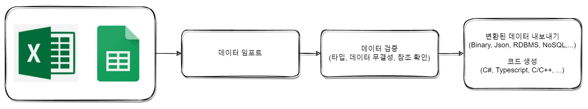

### Features

- 엑셀 뿐만 아니라 구글스프레드시트를 동시에 지원하므로, 데이터 작성 툴을 선택함에 있어서 선택지가 다양합니다.
- 데이터의 기본 유효성을 검증합니다. 정적으로 체크할 수 있는 부분은 최대한 변환 과정에서 체크하여 휴먼오류를 줄여줍니다.
- 데이터 정규화를 위해서 테이블간 참조를 지원합니다.
- 자동 패치 기능을 지원하므로 CDN등의 서비스에 파일을 올려두기만 하면 사용하는 프로그램에서는 항상 최신데이터로 유지할 수 있습니다.
- 다양한 언어를 지원합니다. 현재는 C#, Typescript를 지원하지만 향후 다양한 언어 지원을 늘려갈 예정입니다.
- 실제 프로그램에 로드된 데이터를 눈으로 확인할 수 있어 잘못된 데이터로 인한 불안감을 줄여줄수 있습니다.
- 다양한 파일 형식 및 데이터베이스등으로 익스포트가 가능합니다.
- 데이터에 문제가 있을 경우 데이터 원본이 위치한 곳으로 바로 이동하여 확인할 수 있도록 해줍니다.
- 변환 도중 오류 발생시 원자적으로 동작합니다. 빌드 실패시에 기존에 생성되었던 결과물에 어떠한 영향도 미치지 않도록 설계되어 있습니다. (All or Nothing)

__정의된 엔티티를 사용하기 위해서 단 한줄의 코드도 작성할 필요가 없습니다!__

---


### Prerequisites

`SheetMan`은 `.NET Core 3.x` 기반으로 만들어졌습니다. 먼저 아래 링크를 참고하셔서 각 운영체제에 맞는 `.NET Core`를 설치하셔야합니다.

[각 운영체제에 맞는 .NET Core 설치](https://docs.microsoft.com/en-us/dotnet/core/install/)


### Terminologies

시작하기에 앞서서 몇가지 용어에 대해서 얘기하겠습니다.

|용어|설명|
|--|--|
|문서|엑셀에서는 파일이 문서가 되고, 구글스프레드 시트에서는 `sheets`가 문서에 해당합니다. 다만 `sheets`는 `plural` 형의 단어이므로 헷갈리지 않게 `문서`라는 용어로 통칭하겠습니다.|
|시트|시트는 엑셀 또는 구글스프레드시트의 시트를 말합니다.|
|Entity|`SheetMan`에서 지원하는 각 정의 요소들을 말합니다.|
|Recipe 파일|`SheetMan`에서 사용하는 입력 소스 시트 및 출력 옵션등을 설정하기 위한, .json 형식의 파일입니다.|
|Name Case|Camel / Pascal / Snake / Kebab 등의 이름 표기 형식을 얘기합니다.|


### Excel

지정한 폴더안의 모든(하위 경로포함) `.xlsx` 파일을 가져와서 처리하게 됩니다. 단, 이때 사용할 파일과 아닌 파일이 섞여 있는 경우에는 기본적으로 모든 파일이 변환 대상이 되므로 문제가 될수 있습니다. 이때에는 폴더명 및 파일명에 `#`을 앞에 붙여주면 변환대상에서 제외됩니다. 또한, 변환할 파일이 엑셀에서 열려져 있는 경우에는 파일이 잠금이 되어 있어서 변환에 실패할 수 있습니다.

또한 [다양한 엑셀 파일 확장자](https://support.microsoft.com/ko-kr/office/excel%EC%97%90%EC%84%9C-%EC%A7%80%EC%9B%90%ED%95%98%EB%8A%94-%ED%8C%8C%EC%9D%BC-%ED%98%95%EC%8B%9D-0943ff2c-6014-4e8d-aaea-b83d51d46247)들이 있을 수 있습니다.

이때에는 입력 소스지정에 `FilePatterns`을 지정해주면 가능합니다. 특별히 지정하지 않는 경우에는 와일드 카드(*)를 지정하면 됩니다.


### Google Spread Sheets

[구글개발자 콘솔](https://console.cloud.google.com) 사이트에 들어가서 먼저 프로젝트를 하나만들고, `OAuth2` 사용자 인증 정보를 획득해야합니다. 다운로드 받은 인증 파일을 임의 위치에 저장한 후 `recipe` 파일에 설정해 주어야합니다. 최초 실행시 한번은 `OAuth2` 확인 과정을 거치게 됩니다. 만약, 이과정을 생략하고 싶다면 `~/.credentials/sheets.googleapis.com-sheetman`에 생긴 파일을 다른 피씨의 같은 경로에 복사해두면 위 과정을 생략할 수 있습니다.


#### 1. 프로젝트 생성

> 작성중


#### 2. `OAuth2` 사용자 인증 정보를 획득

1. 아래 화면에서 `사용자 인증 정보 만들기`를 클릭합니다.
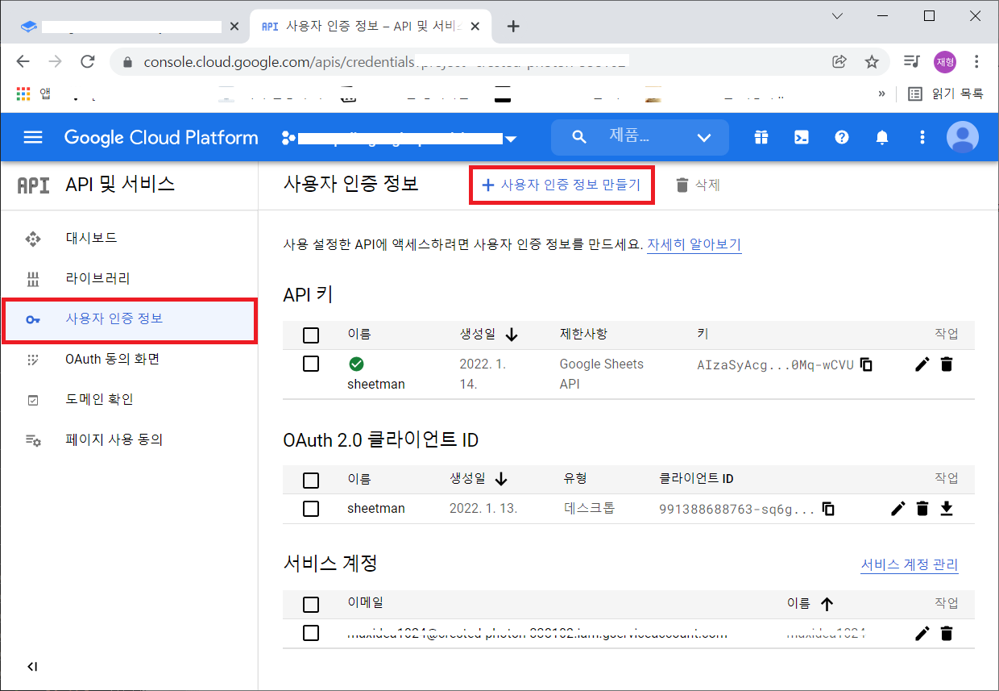

2. `OAuth 클라이언트 ID`를 선택합니다.
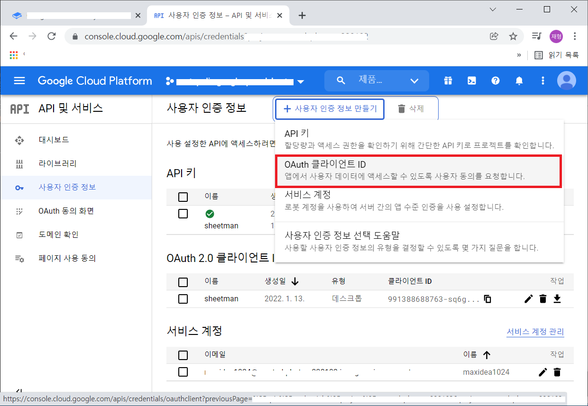

3. `어플리케이션 유형*`은 `데스크톱 앱`으로 설정하고, `이름*`은 `SheetMan`으로 한 후 `만들기` 버튼을 클릭합니다.
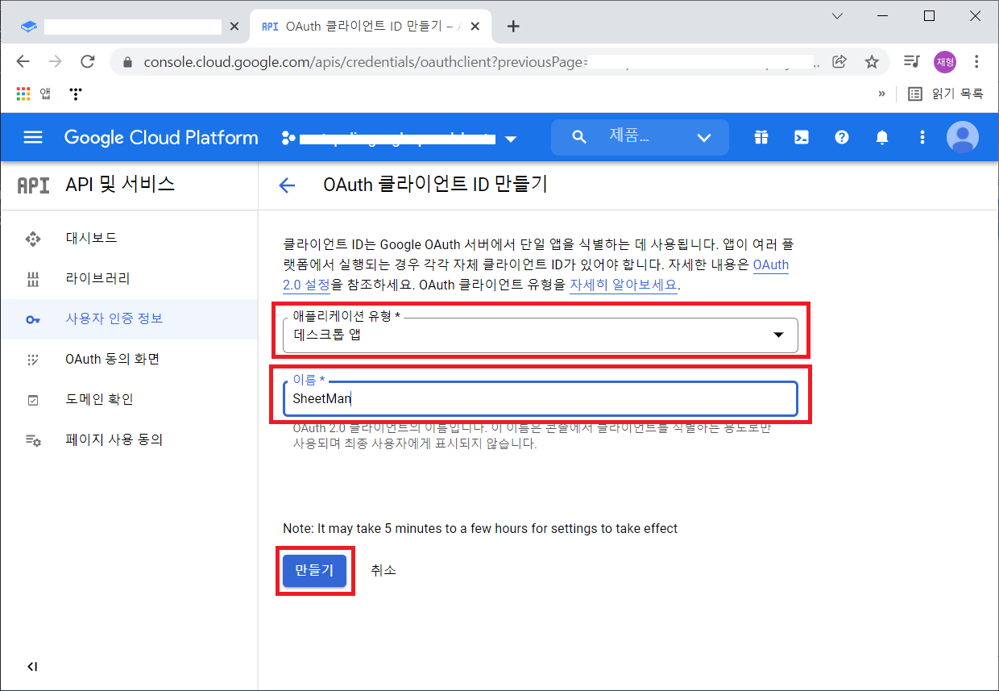

4. `JSON 다운로드` 버튼을 클릭해서 인증정보가 담긴 파일을 다운로드합니다.
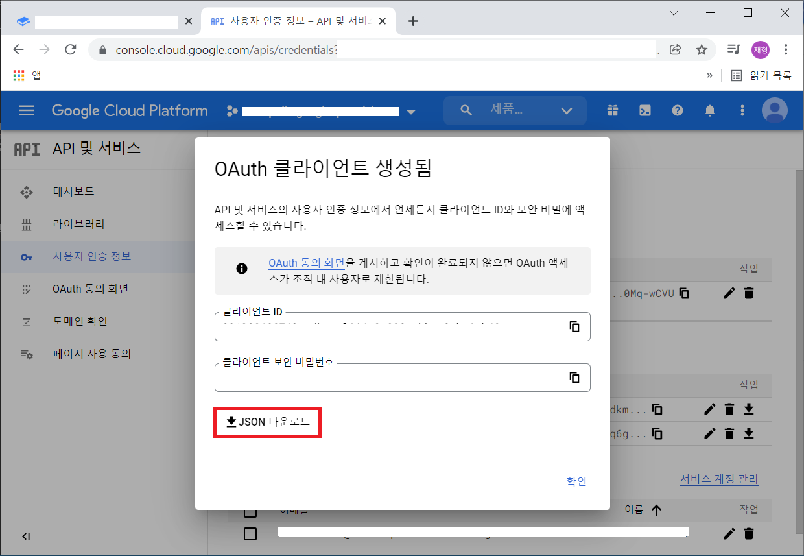

5. 다운로드한 파일을 임의의 위치에 저장해둡니다.
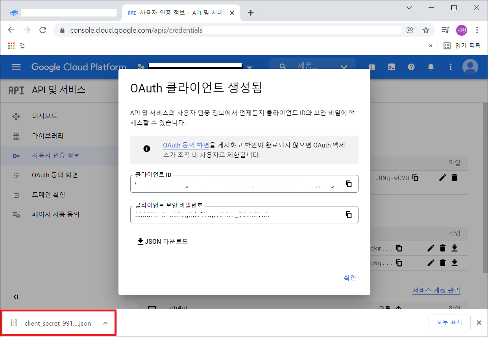

위에서 저장해둔 파일명을 기억해 두었다가 추후 설명할 `recipe` 파일에 기입해주어야합니다.


### 인식되는 문서/시트 대상

`recipe` 파일에 지정된 모든 엑셀/구글스프레드시트들을 하나의 입력소스로 간주됩니다. 여러개의 파일로 나뉘어져 있어도 최종적으로 프로그램에서 바라볼때는 하나의 모델링된 데이터 안으로 모이게 됩니다. 즉, 편집의 편의성을 위해서만 여러개의 파일 또는 시트로 나누었을뿐 최종적으로는 하나의 결과를 만들어내는 형태입니다.

즉, 여러개의 파일 또는 시트로 나뉘어져 있어도 결국 하나의 시트로 인식하게 됩니다.


### 시트 공간 사용 방법

시트 하나에 여러개의 엔티티를 정의할수도 있고, 편집 편의성을 위해서 여러개의 시트로 나누어서 작성할수도 있습니다. 특별히 제한을 두지 않는 구조입니다. 또한 하나의 시트에 여러개의 엔티티를 몰아서 정의할때도 빈틈없이 배치해도 아무런 문제가 없습니다. 다만 보기좋게 한칸 정도 공간을 띄워주면 좋을것입니다.

단, 주의해야할 점이 하나 있습니다. 각 엔티티 기본 정의요소 바로 옆에 엔티티가 아닌 부분을 작성하면 엔티티 정의의 일부로 인식될 수 있으므로, 한칸 띄운 곳의 셀에 작성해주셔야 합니다. 엔티티 바로 옆에 다른 엔티티를 정의하는것은 문제가 없으나, 엔티티 정의 바로 옆에 엔티티가 아닌 부분이 오면 문제가 생깁니다.

#### 시트 하나에 하나씩 배치
일반적인 배치 방법이며, 데이터가 많을 경우 틀고정을 사용할 수 있는 장점이 있습니다.

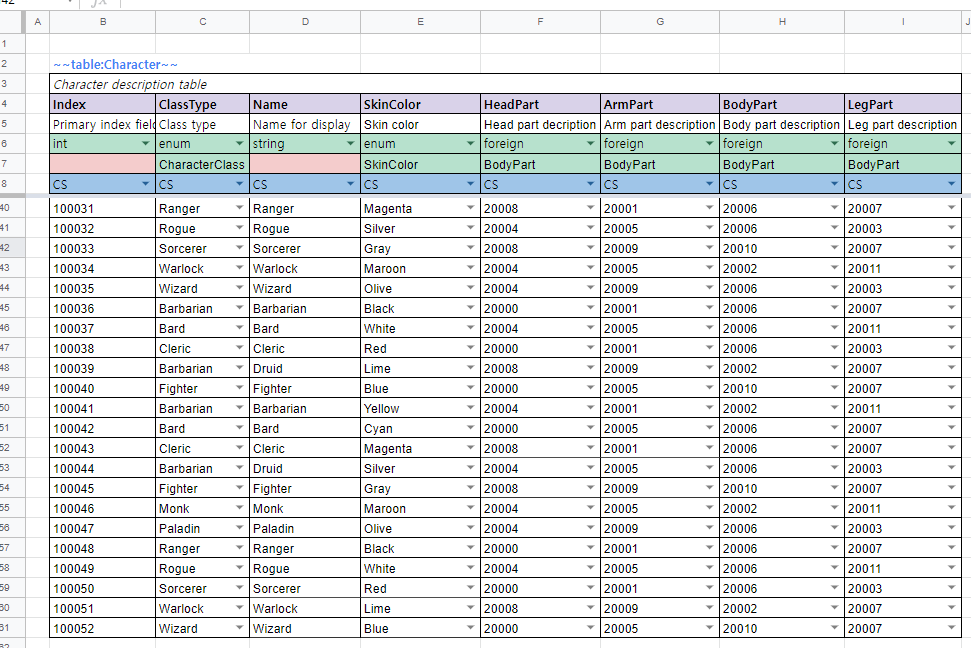

#### 한칸씩 띄워서 여러개 배치 (다소 복잡하지만 한눈에 확인 가능)

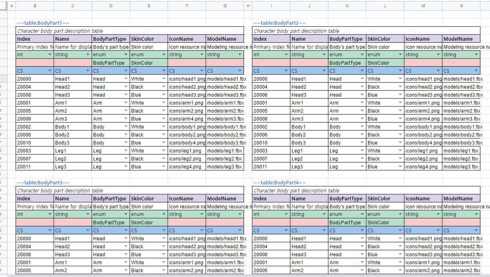

#### 빈틈없이 빼곡하게 배치 (알뜰형?)

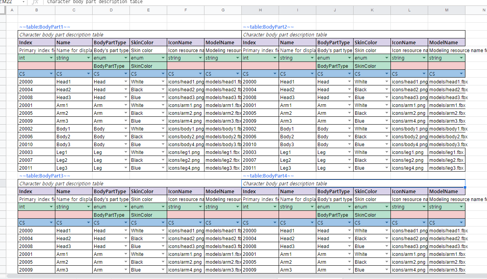

#### 임의 위치로 지그재그로 배치 (일단 모아놓고 보자! 정리는 나중에?)

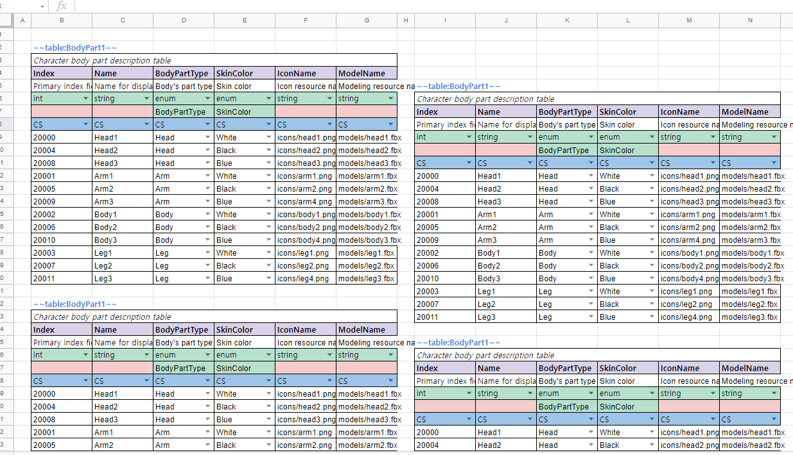

#### 엔티티 영역외에 내용 적기
엔티티 정의 영역외의 부분은 변환과정에 관여하지 않으므로 메모등을 사용해도 좋습니다.

__다만, 한칸 정도 띄우고 사용해야합니다.__

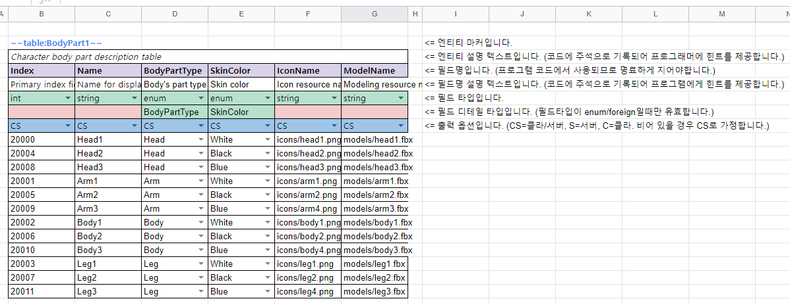

#### <font color=red>엔티티들이 맞붙은건 상관없지만, 서로 침범하면 안됨</font>

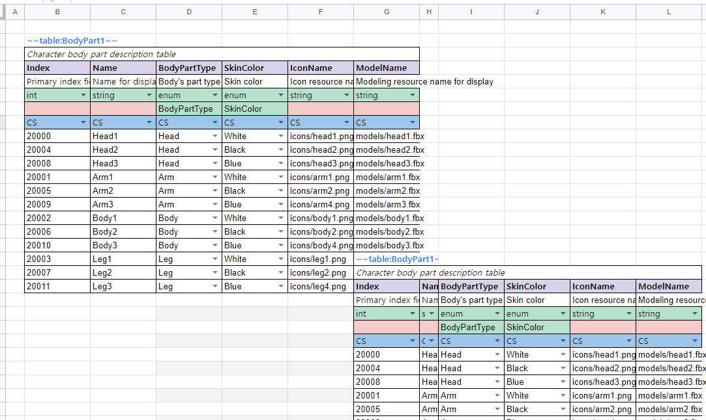

__위의 배치 방법중 데이터를 작성하거나 보는 사람이 불편함이 없다면, 자유롭게 사용해도 무방합니다. 단,  침범(cross-section)이 발생하면 안됩니다.__


### Entity Marker

|마커종류|설명|
|--|--|
|`~~enum:CharacterClass~~`|enum 정의 시작 표시용 마커|
|`~~const:Constants~~`|상수정의 정의 시작 표시용 마커|
|`~~table:Character~~`|테이블 정의 시작 표시용 마커|


위와 같은 형태를 `Entity Marker`라고 합니다. 각 엔티티 정의의 시작 부분을 나타내기 위해서 사용되어집니다. 아름답지 않게 앞뒤로 `~~` 문자를 식별자로 사용하는 이유는 시트내의 셀들을 좀더 자유롭게 사용할 수 있도록 하기 위함입니다.

마커 태그 표현식은 아래와 같습니다.

`~~` `entity-type` `:` `entity-name` [`:` `target-side`] `~~`

|구분|설명|
|--|--|
|entity-type|정의할 엔티티의 타입을 나타냅니다. (현재는 enum / const / table중 하나를 지정할 수 있습니다.)|
|entity-name|엔티티의 이름을 지정합니다. 엔티티의 이름은 __타입에 상관 없이 유니크__ 해야합니다.|
|target-side|출력 대상을 지정합니다. (선택사항이며, 생략했을 경우 CS(서버/클라 모두)로 지정됩니다.)|

> 마커 태그 사이의 공백은 무시됩니다. `~~   const   :   MyConstants  ~~` 이렇게 해도 상관없습니다. 다만, 공백은 가급적 사용하지 않는것을 권해드립니다.


### Trimming

데이터를 불러올때 모든 셀의 값을 `Trimming` 한후 불러오게 됩니다. 아무리 앞뒤로 공백을 넣는다고 해도 무시 되므로 주의가 필요합니다. UI의 텍스트로 출력하거나 할때 앞뒤 공백으로 레이아웃을 맞추는등의 시도는 작동하지 않을것입니다. 꼭 해야한다면 공백대신 다른 문자를 넣어주고 그 문자를 공백문자로 치환하는 형태로 처리해야 할것입니다.


### Naming Rules

모든 엔티티 및 필드 이름은 내부적으로 `Pascal case`로 자동변환 됩니다. 이는 처리의 단순화를 위해서 결정한 사항입니다.

다만, 다음과 같은 부작용이 발생할 수 있으므로 주의해야합니다.

1. `_` (underscore) 의 갯수로 구분 지은 후 다른 이름이라고 생각하면 안됩니다.
예를들어 "x_y" (undersocre 한개) 와 "x__y" (underscore 두개) 는 실제로 프로그램에서는 "Xy"로 인식하게 되므로, 이름이 겹치는 걸로 인식되어 오류 메시지를 표시하게 됩니다.
기본적으로 "_" 의 갯수로 구분지어서 작명하는것은 가독성도 떨어지고 좋은 방법은 아닐것입니다.
2. 이름은 길지 않은 선에서 최대한 의미있게 지어야합니다. 프로그램 코드에 대부분 직접 반영되는 요소이기 때문에 명확한 함의가 있을수록 좋습니다.
3. 일부언어(camel case 위주로 사용하는 typescript같은 언어)에서는 예약어(if, else, ...)를 사용할 경우 코드 생성에 실패할 수 있고, 최종 컴파일 과정에서 실패할 수 있습니다. 가급적이면 일반적인 프로그래밍 예약어는 사용하지 마십시오.

### Supported Entities

현재는 다음의 엔티티들을 지원하며, 차후 `VariableSet`, `Formula`등을 추가할 계획입니다.

|종류|설명|비고|
|--|--|--|
|Enum|열거형 정의|지원|
|ConstantSet|상수 정의 묶음|지원|
|~~VariableSet~~|Mutation이 가능한 변수들 묶음|개발예정|
|~~Formula~~|런타이중 평가가능한 수식|개발예정|
|Table|데이터 테이블 정의 및 데이터|지원|


### Parsing Rules

기본적으로 C#의 Parsing Rules를 따르지만, 일부 타입은 자체적으로 파싱합니다.

|타입|코드|비고|
|---|---|--|
|string|그대로 읽어옴|Trimming을 한 후 읽어옵니다.|
|int|int.Parse(value)|`,` 문자들은 제거하고 파싱을 합니다.|
|bigint|long.Parse(value)|`,` 문자들은 제거하고 파싱을 합니다.|
|float|float.Parse(value)|`,` 문자들은 제거하고 파싱을 합니다.|
|double|double.Parse(value)|`,` 문자들은 제거하고 파싱을 합니다.|
|bool|ParseBool(value)|bool.Parse() 대신 자체적으로 파싱합니다.|
|datetime|DateTime.Parse(value)|[MSDN 참고](https://docs.microsoft.com/en-us/dotnet/api/system.datetime.parse?view=net-6.0)|
|timespan|TimeSpan.Parse(value)|[MSDN 참고](https://docs.microsoft.com/en-us/dotnet/api/system.timespan.parse?view=net-6.0#system-timespan-parse(system-string))|
|uuid|Guid.Parse(value)|[MSDN 참고](https://docs.microsoft.com/en-us/dotnet/api/system.guid.parse?view=net-6.0#system-guid-parse(system-string))|


### 작성중인 데이터 임시로 제외하기

데이터 작성도중 아직 완벽하게 작성된 데이터가 아닌 문서/시트들도 있을것입니다. 이를 변환과정에서 제외하고 싶다면, 다른 폴더로 옮기던지 하는 방법이 있을수 있겠지만, 다소 번거로울 수 있습니다. 이때 파일명 또는 시트명 그리고 필드명, 변수명에 아래와 같이 Prefix를 붙여주면 변환대상에서 제외됩니다.

폴더,문서,시트,엔티티,필드명 앞에 `#` 또는 `//`를 붙여주게 되면 변환 대상에서 제외됩니다.
단, 엑셀에서는 `//` 문자를 입력할 수 없으므로 `#` 만 사용할 수 있습니다.

#### 문서(엑셀 파일 또는 구글시트 문서) 제외하기
파일명(엑셀의 경우 폴더명도 제외 가능) 또는 문서명에 `#` 또는 `//`를 붙여줍니다. 다만, 구글시트의 경우에는 문서를 지정해서 변환 대상으로 삼기 때문에 `recipe` 파일에서 구글시트 ID를 지정하는 부분을 주석처리하면 됩니다.

#### 시트 제외하기
시트명 앞에 `#` 또는 `//`를 붙여줍니다.


#### 엔티티 제외하기
엔티티 마커 태그 앞에 `#` 또는 `//`를 붙여줍니다.

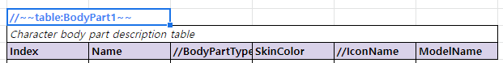

#### 필드 제외하기
필드명 앞에 `#` 또는 `//`를 붙여줍니다. 단, `primary index` 필드는 제외할 수 없습니다.

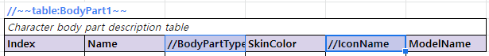


### 엔티티 정의방법
- enum 정의
- 상수 테이블 정의
- 테이블 정의

각 엔티티 정의 방법을 구체적으로 사용해야함.


### Primary Index Field

테이블을 정의할때 필수로 있어야하는 필드로, 테이블 로우(행)의 기본 인덱스가 됩니다. 다음의 조건을 만족해야합니다.
- 이름은 "index" 여야 합니다. (대소문자 상관없음)
- `int` 타입이어야합니다.
- 인덱스 값들은 `unique` 해야 합니다.

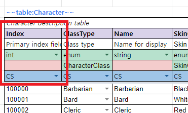


### Secondary Index Field

`Primary index`외에 빠른 검색을 위해서 추가로 인덱싱을 하고 싶은 필드가 있을 수 있습니다. 예를들어, 이름으로 검색을 빠르게 혹은 편하게 하고 싶다면 아래와 같이 `Name` 필드에 `*` 문자를 앞에 붙여주면 됩니다. 보조키 필드가 되기 위해서는 필드의 값들이 `unique` 해야 합니다.

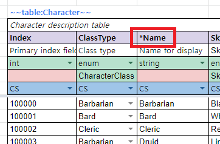


### Supported Data Types

`SheetMan`에서 지원하는 데이터 타입은 아래와 같습니다.

|Type|Description|Range|
|--|--|--|
|string|A sequence of UTF8 characters| |
|int|32-bit signed integer|-2,147,483,648 ~ 2,147,483,647|
|bigint|64-bit signed integer|-9,223,372,036,854,775,808 ~ 9,223,372,036,854,775,807|
|float|32-bit single-precision floating point type|-3.402823e38 ~ 3.402823e38|
|double|64-bit double-precision floating point type|-1.79769313486232e308 ~ 1.79769313486232e308|
|bool|8-bit logical true/false value|true or false|
|datetime|Represents date and time|0:00:00am 1/1/01 ~ 11:59:59pm 12/31/9999|
|timespan|Represents a time interval.|[MSDN 참고](https://docs.microsoft.com/en-us/dotnet/api/system.timespan.parse?view=net-6.0#system-timespan-parse(system-string))|
|uuid|Represents a globally unique identifier (GUID).|[MSDN 참고](https://docs.microsoft.com/en-us/dotnet/api/system.guid?view=net-6.0)|
|enum|자체적으로 선언된 엔티티 enum| |
|foreign|외부 테이블 참조| |

현재 배열타입의 자료형은 지원하지 않고 있습니다. 대신에 `SerialField`라는것을 지원합니다. 하지만, `SerialField`는 각 로우별 배열의 갯수가 고정이라는 문제점이 있어서 향후 배열 타입의 자료형을 추가할 생각입니다. 자세한건 `SerialField` 설명 부분의 내용을 참고하세요.


### Serial Field

`SheetMan`은 기본적으로 `배열(Array)` 타입의 자료형을 지원하지 않습니다. `배열`은 흔히 사용되는 자료형일 텐데 지원하지 않는 이유가 궁금할것입니다. 원래는 지원을 했었는데, 셀 편집시에 불편한점 때문에 제거하였습니다. 이에 대한 대안으로 `SerialField`라는 요소를 추가하였습니다. 하지만, 막상 `SerialField`를 적용해보니 각 로우마다 배열의 길이를 달리 가져갈수가 없는 단점이 있었습니다. 이에, 다시 `배열` 지원을 추가할 예정입니다.

|종류|장점|단점|
|--|--|--|
|SerialField|배열의 요소를 각 셀단위로 편집이 용이하다.|로우마다 배열의 길이를 다르게 가져갈 수 없다.|
|구분자를 통한 배열|각 로우마다 배열의 길이를 다르게 가져갈수 있다.|셀 단위의 편집이 용이하지 못하다. 엑셀의 편리한 편집 도구등을 활용하지 못한다.|


### Null 참조

작성중

---


### Build

작성중

`build/` 폴더에 빌드용 스크립트들이 있습니다. 각 플랫폼별로 빌드하려면 아래 표를 참고하세요.

|플랫폼|빌드스크립트|
|--|--|
|Windows|build-win64.bat|
|Linux|build-linux64.sh|
|Mac|build-osx64.sh|

빌드 전에 [.NET Core 3.x](https://docs.microsoft.com/en-us/dotnet/core/install/)를 설치해 주셔야합니다.


### Run

작성중


### Recipe 파일 작성

샘플 파일 작성 예제

<details>

```json
{
  "CodeGenerations": {
    "Cpp": [],
    "CSharp": [
        {
           // 출력 타겟 폴더입니다. 만약 해당 폴더가 존재하지 않는다면 자동으로 폴더를 만들게 됩니다.
           // 이로인해서 지저분하게 생성되는 문제가 있을수도 있으므로, 한번더 확인할 필요가 있습니다.
           "Path": "./generated/cs",

           // 
           "Namespace": "StaticData",
           "AccessorName": "SheetAccessor"
        }
    ],
    "Typescript": [
        {
           "Path": "./generated/ts",
           //"Namespace": "",
           //"AccessorName": "SheetAccessor"
        }
    ],
    "Html": [
      {
        "Path": "./generated/html"
      }
    ]
  },
  "Sources": {
    "Xlsx": [],
    "GoogleSheets": [
      {
        "ClientSecretFilename": "./googlesheets-client-secret.json",
        "SheetsId": "10NXZAeyFaxRFsC8BPVTS9A6DzsM57Z1tizpJMCokJwU"
      }
    ]
  },
  "Exports": {
    "Binary": [
        {
            "Path": "./generated/binary"
        }
    ],
    "Json": [
        {
            "Path": "./generated/json"
        }
    ],
    "MongoDb": [],
    "MySql": []
  }
}
```

</details>


### Export

임포트되고 가공된 데이터를 다양한 익스포터를 통해서 익스포트가 가능합니다.

|대상|설명|지원여부|
|--|--|--|
|Binary|자체 포맷 바이너리 파일|지원함|
|Json|.json 파일|지원함|
|MongoDB|MongoDB로 데이터를 적재합니다.|지원 예정|
|MySql|MySql로 데이터를 적재합니다.|지원 예정|
|Redis|Redis로 데이터를 적재합니다.|지원 예정|


### Code Generation

작성중

#### C# 코드생성

[예제](csharp.md)를 참고하세요.


### Unity3D Integration

작성중


### TODO

- ~~참조 기능 강화 및 필드 참조 기능 구현~~

- ~~디테일한 오류처리~~

- ~~엔티티 레이아웃 확장~~

- ~~상수 테이블 관련 코드 생성~~

- ~~소스파일에 구글 시트인 경우 정의 위치를 url로 출력하는게 좋을듯. 바로 확인할 수 있으니..~~

- ~~건너뛴 시트들과 처리된 시트들을 확인할 수 있는 수단을 제공하자.~~

- ~~`manifest` 파일생성~~

- ~~Summary 파일을 별도로 기록해서 남겨두면 좋을듯..~~

- ~~키 컬럼의 데이터가 유니크한지 체크~~

- ~~키 컬럼의 데이터에 빈값이 있는것을 허용해야하나?~~

- ~~필드를 주석처리하면 오류 발생.~~

- TargetSide 적용

- 배열 타입을 지원하자. 구분자는 무엇으로해야하나?

- typescript 코드 생성

- typescript serializer 작성


### References

- [Google.Apis.Sheets](https://github.com/googleapis/google-api-dotnet-client)
- [NPOI](https://github.com/nissl-lab/npoi)
- [Serilog](https://serilog.net/)
- [CommandLineParser](https://github.com/commandlineparser/commandline)
- [Netonsoft.Json](https://www.newtonsoft.com/json)