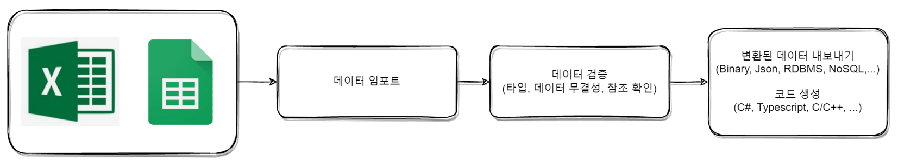
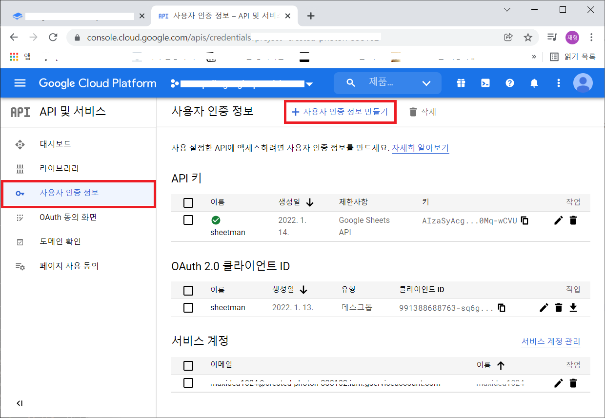
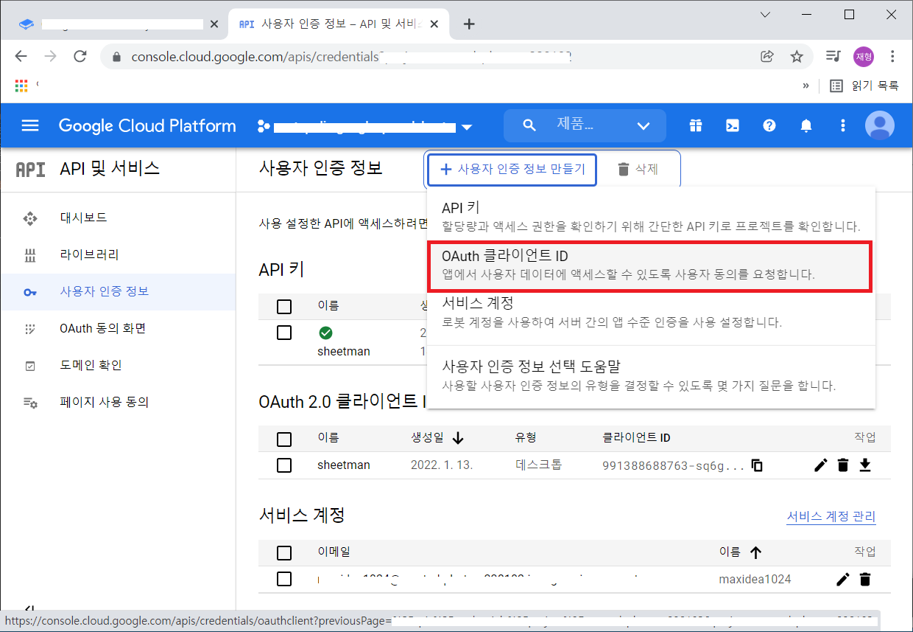
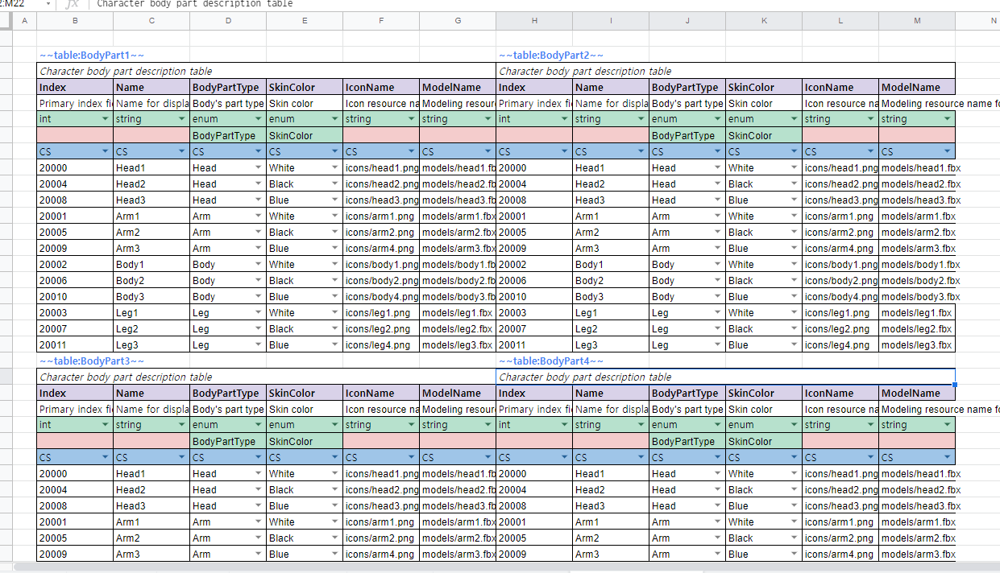
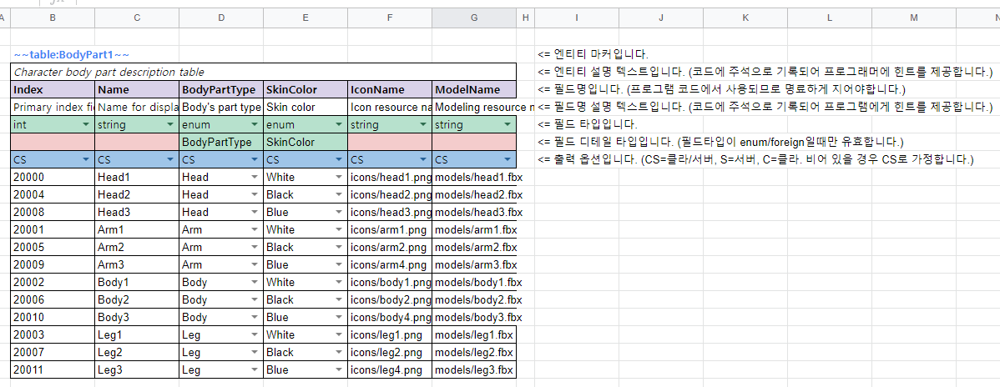
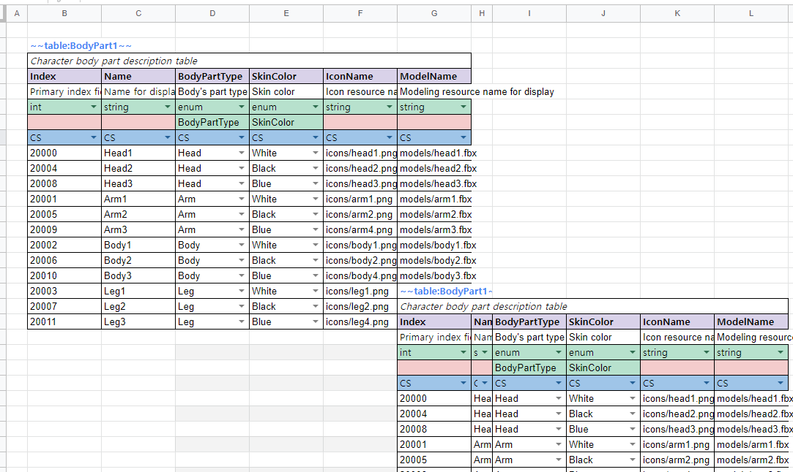
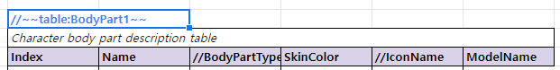

# SheetMan

엑셀 또는 구글스프레드시트로 작성한 테이블 데이터를 프로그램에서 사용하기 쉬운 형태로 가공하고 정적 검증을 해주는 간단한 `Command Line Interface` 형태의 도구입니다.



### Features

- 엑셀 뿐만 아니라 구글스프레드시트를 동시에 지원하므로, 데이터 작성 툴을 선택함에 있어서 선택지가 다양합니다.
- 데이터의 기본 유효성을 검증합니다. 정적으로 체크할 수 있는 부분은 최대한 변환 과정에서 체크하여 휴먼오류를 줄여줍니다.
- 데이터 정규화를 위해서 테이블간 참조를 지원합니다.
- 자동 패치 기능을 지원하므로 CDN등의 서비스에 파일을 올려두기만 하면 사용하는 프로그램에서는 항상 최신데이터로 유지할 수 있습니다.
- 다양한 언어를 지원합니다. 현재 C#, TypeScript, C++, Go, Rust, Python, Java, Kotlin, Ruby, Dart 코드와 Unreal 모듈을 생성합니다.
- 실제 프로그램에 로드된 데이터를 눈으로 확인할 수 있어 잘못된 데이터로 인한 불안감을 줄여줄수 있습니다.
- 파일(바이너리 / JSON)뿐 아니라 MySQL / PostgreSQL / MongoDB / Redis로 직접 적재할 수 있습니다.
- 서버/클라이언트 중 한쪽만 필요한 엔티티와 필드를 출력 대상별로 걸러낼 수 있습니다. (`TargetSide`)
- **누가 언제 무엇을 바꿨는지 셀 단위로 추적**하고, 웹 브라우저에서 확인할 수 있습니다. (`--serve`)
- 데이터에 문제가 있을 경우 데이터 원본이 위치한 곳으로 바로 이동하여 확인할 수 있도록 해줍니다.
- 시트의 문제를 한 번에 모아서 보고합니다. 오류 하나당 한 번씩 재실행할 필요가 없습니다.
- 변환 도중 오류 발생시 원자적으로 동작합니다. 파일은 스테이징 영역을 거쳐 마지막에 일괄 커밋되고, 데이터베이스는 섀도 테이블에 적재한 뒤 원자적으로 교체합니다. (All or Nothing)

> 원자성은 **스토어 단위**입니다. 파일과 데이터베이스 여러 개를 하나의 트랜잭션으로 묶는 것은 분산 트랜잭션 없이는 불가능하므로, 각 스토어가 개별적으로 원자적이 되도록 설계되어 있습니다.

__정의된 엔티티를 사용하기 위해서 단 한줄의 코드도 작성할 필요가 없습니다!__

---


### Prerequisites

`SheetMan`은 `.NET 10` 기반으로 만들어졌습니다. 먼저 아래 링크를 참고하셔서 각 운영체제에 맞는 `.NET SDK`를 설치하셔야합니다.

[각 운영체제에 맞는 .NET 설치](https://dotnet.microsoft.com/download)

SDK 버전은 리포지토리 루트의 `global.json`에 고정되어 있습니다.

생성된 코드를 사용하는 쪽의 요구사항은 다음과 같습니다.

|대상|요구사항|
|--|--|
|C# / Unity|Unity 2020.3 이상 (C# 8 / netstandard2.1)|
|TypeScript|TypeScript 4.5 이상. 바이너리 리더가 `BigInt`를 사용하므로 컴파일 타겟은 `ES2020` 이상|
|C++|C++17 이상|

**생성된 코드는 자립적입니다.** 세 언어 모두 바이너리 리더가 출력 폴더에 함께 생성되므로, 플러그인 설치나 include 경로 설정 같은 준비 작업이 없습니다. 생성물을 프로젝트에 넣으면 그대로 컴파일됩니다.


### Terminologies

시작하기에 앞서서 몇가지 용어에 대해서 얘기하겠습니다.

|용어|설명|
|--|--|
|문서|엑셀에서는 파일이 문서가 되고, 구글스프레드 시트에서는 `sheets`가 문서에 해당합니다. 다만 `sheets`는 `plural` 형의 단어이므로 헷갈리지 않게 `문서`라는 용어로 통칭하겠습니다.|
|시트|시트는 엑셀 또는 구글스프레드시트의 시트를 말합니다.|
|Entity|`SheetMan`에서 지원하는 각 정의 요소들을 말합니다.|
|Recipe 파일|`SheetMan`에서 사용하는 입력 소스 시트 및 출력 옵션등을 설정하기 위한, .json 형식의 파일입니다.|
|Name Case|Camel / Pascal / Snake / Kebab 등의 이름 표기 형식을 얘기합니다.|


### Excel

지정한 폴더안의 모든(하위 경로포함) `.xlsx` 파일을 가져와서 처리하게 됩니다. 단, 이때 사용할 파일과 아닌 파일이 섞여 있는 경우에는 기본적으로 모든 파일이 변환 대상이 되므로 문제가 될수 있습니다. 이때에는 폴더명 및 파일명에 `#`을 앞에 붙여주면 변환대상에서 제외됩니다. 또한, 변환할 파일이 엑셀에서 열려져 있는 경우에는 파일이 잠금이 되어 있어서 변환에 실패할 수 있습니다.

또한 [다양한 엑셀 파일 확장자](https://support.microsoft.com/ko-kr/office/excel%EC%97%90%EC%84%9C-%EC%A7%80%EC%9B%90%ED%95%98%EB%8A%94-%ED%8C%8C%EC%9D%BC-%ED%98%95%EC%8B%9D-0943ff2c-6014-4e8d-aaea-b83d51d46247)들이 있을 수 있습니다.

이때에는 입력 소스지정에 `FilePatterns`을 지정해주면 가능합니다. 특별히 지정하지 않는 경우에는 와일드 카드(*)를 지정하면 됩니다.


### Google Spread Sheets

[구글개발자 콘솔](https://console.cloud.google.com) 사이트에 들어가서 먼저 프로젝트를 하나만들고, `OAuth2` 사용자 인증 정보를 획득해야합니다. 다운로드 받은 인증 파일을 임의 위치에 저장한 후 `recipe` 파일에 설정해 주어야합니다. 최초 실행시 한번은 `OAuth2` 확인 과정을 거치게 됩니다. 만약, 이과정을 생략하고 싶다면 `~/.credentials/sheets.googleapis.com-sheetman`에 생긴 파일을 다른 피씨의 같은 경로에 복사해두면 위 과정을 생략할 수 있습니다.


#### 1. 프로젝트 생성

> 작성중


#### 2. `OAuth2` 사용자 인증 정보를 획득

1. 아래 화면에서 `사용자 인증 정보 만들기`를 클릭합니다.


2. `OAuth 클라이언트 ID`를 선택합니다.


3. `어플리케이션 유형*`은 `데스크톱 앱`으로 설정하고, `이름*`은 `SheetMan`으로 한 후 `만들기` 버튼을 클릭합니다.


4. `JSON 다운로드` 버튼을 클릭해서 인증정보가 담긴 파일을 다운로드합니다.


5. 다운로드한 파일을 임의의 위치에 저장해둡니다.


위에서 저장해둔 파일명을 기억해 두었다가 추후 설명할 `recipe` 파일에 기입해주어야합니다.


### 인식되는 문서/시트 대상

`recipe` 파일에 지정된 모든 엑셀/구글스프레드시트들을 하나의 입력소스로 간주됩니다. 여러개의 파일로 나뉘어져 있어도 최종적으로 프로그램에서 바라볼때는 하나의 모델링된 데이터 안으로 모이게 됩니다. 즉, 편집의 편의성을 위해서만 여러개의 파일 또는 시트로 나누었을뿐 최종적으로는 하나의 결과를 만들어내는 형태입니다.

즉, 여러개의 파일 또는 시트로 나뉘어져 있어도 결국 하나의 시트로 인식하게 됩니다.


### 시트 공간 사용 방법

시트 하나에 여러개의 엔티티를 정의할수도 있고, 편집 편의성을 위해서 여러개의 시트로 나누어서 작성할수도 있습니다. 특별히 제한을 두지 않는 구조입니다. 또한 하나의 시트에 여러개의 엔티티를 몰아서 정의할때도 빈틈없이 배치해도 아무런 문제가 없습니다. 다만 보기좋게 한칸 정도 공간을 띄워주면 좋을것입니다.

단, 주의해야할 점이 하나 있습니다. 각 엔티티 기본 정의요소 바로 옆에 엔티티가 아닌 부분을 작성하면 엔티티 정의의 일부로 인식될 수 있으므로, 한칸 띄운 곳의 셀에 작성해주셔야 합니다. 엔티티 바로 옆에 다른 엔티티를 정의하는것은 문제가 없으나, 엔티티 정의 바로 옆에 엔티티가 아닌 부분이 오면 문제가 생깁니다.

#### 시트 하나에 하나씩 배치
일반적인 배치 방법이며, 데이터가 많을 경우 틀고정을 사용할 수 있는 장점이 있습니다.


#### 한칸씩 띄워서 여러개 배치 (다소 복잡하지만 한눈에 확인 가능)


#### 빈틈없이 빼곡하게 배치 (알뜰형?)



#### 임의 위치로 지그재그로 배치 (일단 모아놓고 보자! 정리는 나중에?)


#### 엔티티 영역외에 내용 적기
엔티티 정의 영역외의 부분은 변환과정에 관여하지 않으므로 메모등을 사용해도 좋습니다.

__다만, 한칸 정도 띄우고 사용해야합니다.__



#### <font color=red>엔티티들이 맞붙은건 상관없지만, 서로 침범하면 안됨</font>



__위의 배치 방법중 데이터를 작성하거나 보는 사람이 불편함이 없다면, 자유롭게 사용해도 무방합니다. 단,  침범(cross-section)이 발생하면 안됩니다.__


### Entity Marker

|마커종류|설명|
|--|--|
|`~~enum:CharacterClass~~`|enum 정의 시작 표시용 마커|
|`~~const:Constants~~`|상수정의 정의 시작 표시용 마커|
|`~~table:Character~~`|테이블 정의 시작 표시용 마커|


위와 같은 형태를 `Entity Marker`라고 합니다. 각 엔티티 정의의 시작 부분을 나타내기 위해서 사용되어집니다. 아름답지 않게 앞뒤로 `~~` 문자를 식별자로 사용하는 이유는 시트내의 셀들을 좀더 자유롭게 사용할 수 있도록 하기 위함입니다.

마커 태그 표현식은 아래와 같습니다.

`~~` `entity-type` `:` `entity-name` [`:` `target-side`] `~~`

|구분|설명|
|--|--|
|entity-type|정의할 엔티티의 타입을 나타냅니다. (현재는 enum / const / table중 하나를 지정할 수 있습니다.)|
|entity-name|엔티티의 이름을 지정합니다. 엔티티의 이름은 __타입에 상관 없이 유니크__ 해야합니다.|
|target-side|출력 대상을 지정합니다. (선택사항이며, 생략했을 경우 CS(서버/클라 모두)로 지정됩니다.)|

> 마커 태그 사이의 공백은 무시됩니다. `~~   const   :   MyConstants  ~~` 이렇게 해도 상관없습니다. 다만, 공백은 가급적 사용하지 않는것을 권해드립니다.


### Trimming

데이터를 불러올때 모든 셀의 값을 `Trimming` 한후 불러오게 됩니다. 아무리 앞뒤로 공백을 넣는다고 해도 무시 되므로 주의가 필요합니다. UI의 텍스트로 출력하거나 할때 앞뒤 공백으로 레이아웃을 맞추는등의 시도는 작동하지 않을것입니다. 꼭 해야한다면 공백대신 다른 문자를 넣어주고 그 문자를 공백문자로 치환하는 형태로 처리해야 할것입니다.


### Naming Rules

모든 엔티티 및 필드 이름은 내부적으로 `Pascal case`로 자동변환 됩니다. 이는 처리의 단순화를 위해서 결정한 사항입니다.

다만, 다음과 같은 부작용이 발생할 수 있으므로 주의해야합니다.

1. `_` (underscore) 의 갯수로 구분 지은 후 다른 이름이라고 생각하면 안됩니다.
예를들어 "x_y" (undersocre 한개) 와 "x__y" (underscore 두개) 는 실제로 프로그램에서는 "Xy"로 인식하게 되므로, 이름이 겹치는 걸로 인식되어 오류 메시지를 표시하게 됩니다.
기본적으로 "_" 의 갯수로 구분지어서 작명하는것은 가독성도 떨어지고 좋은 방법은 아닐것입니다.
2. 이름은 길지 않은 선에서 최대한 의미있게 지어야합니다. 프로그램 코드에 대부분 직접 반영되는 요소이기 때문에 명확한 함의가 있을수록 좋습니다.
3. 예약어와 겹치는 이름은 **자동으로 회피**되므로 컴파일이 깨지지 않습니다. 다만 생성된 이름이 시트에 적은 것과 달라지므로 알아두는 게 좋습니다.

|언어|멤버 표기|`Class`라는 필드가 되는 이름|
|--|--|--|
|C#|`PascalCase`|`Class` — 모든 C# 예약어가 소문자라 겹칠 일이 없습니다|
|TypeScript|`camelCase`|`class` — TypeScript는 예약어를 멤버 이름으로 허용합니다|
|C++|`snake_case`|`sm_class` — `class`가 그대로 나가면 컴파일이 깨집니다|

TypeScript에서 실제로 문제가 되는 것은 예약어가 아니라 클래스가 선언할 수 없는 이름입니다. `Constructor` 필드는 `constructor_`가 됩니다.

> 이 표는 추측이 아닙니다. `reserved-words` 픽스처가 예약어로 이름 지은 필드를 담고 있고, 회귀 스위트가 그 산출물을 **세 언어 모두 실제로 컴파일**합니다.

### Supported Entities

현재는 다음의 엔티티들을 지원하며, 차후 `VariableSet`, `Formula`등을 추가할 계획입니다.

|종류|설명|비고|
|--|--|--|
|Enum|열거형 정의|지원|
|ConstantSet|상수 정의 묶음|지원|
|~~VariableSet~~|Mutation이 가능한 변수들 묶음|개발예정|
|~~Formula~~|런타이중 평가가능한 수식|개발예정|
|Table|데이터 테이블 정의 및 데이터|지원|


### Parsing Rules

기본적으로 .NET의 파싱 규칙을 따르지만, 일부 타입은 자체적으로 파싱합니다.

**모든 파싱은 `InvariantCulture`로 수행됩니다.** 변환 결과가 빌드를 돌리는 PC의 지역 설정에 따라 달라지면 안 되기 때문입니다. 소수점은 항상 `.`이고 쉼표는 항상 천단위 구분자입니다.

|타입|파싱|비고|
|---|---|--|
|string|그대로|앞뒤 공백을 제거한 후 읽어옵니다.|
|int|`int.Parse`|천단위 구분자 허용. `1,000,000` 가능|
|bigint|`long.Parse`|천단위 구분자 허용|
|float|`float.Parse`|천단위 구분자 허용|
|double|`double.Parse`|천단위 구분자 허용|
|bool|자체 파싱|아래 참고|
|datetime|`DateTime.Parse`|엑셀의 날짜 셀은 자동으로 인식됩니다. 텍스트로 적을 경우 `2022-01-24 10:30:00` 형식을 권합니다.|
|timespan|`TimeSpan.Parse`|`1.02:03:04` (일.시:분:초) 형식. [MSDN 참고](https://learn.microsoft.com/dotnet/api/system.timespan.parse)|
|uuid|`Guid.Parse`|[MSDN 참고](https://learn.microsoft.com/dotnet/api/system.guid.parse)|
|enum|라벨 이름 또는 값|선언된 표기(`fire_ball`), Pascal 표기(`FireBall`), 숫자(`1`) 모두 허용|
|`T[]`|구분자로 분리 후 각 요소 파싱|빈 셀은 빈 배열|

#### bool 파싱

|값|결과|
|--|--|
|`Y` `YES` `TRUE` `1`|참|
|`N` `NO` `FALSE` `0`|거짓|
|빈 셀|거짓|
|그 외 숫자|0이 아니면 참|
|그 외 텍스트|**오류**|

대소문자는 구분하지 않습니다. 빈 셀이 거짓인 것은 의도된 것이지만, 알 수 없는 텍스트는 오류입니다 — `Ture` 같은 오타가 조용히 거짓이 되면 이 도구가 잡아야 할 휴먼 오류가 그대로 데이터에 들어갑니다.

#### 엑셀 수식 오류

수식이 `#DIV/0!`, `#REF!` 등으로 평가된 셀은 오류로 보고됩니다. SheetMan은 수식을 직접 평가하지 않고 파일에 캐시된 결과를 읽으므로, 엑셀에서 오류가 보이는 상태로 저장된 셀이 그대로 걸립니다.


### 작성중인 데이터 임시로 제외하기

데이터 작성도중 아직 완벽하게 작성된 데이터가 아닌 문서/시트들도 있을것입니다. 이를 변환과정에서 제외하고 싶다면, 다른 폴더로 옮기던지 하는 방법이 있을수 있겠지만, 다소 번거로울 수 있습니다. 이때 파일명 또는 시트명 그리고 필드명, 변수명에 아래와 같이 Prefix를 붙여주면 변환대상에서 제외됩니다.

폴더,문서,시트,엔티티,필드명 앞에 `#` 또는 `//`를 붙여주게 되면 변환 대상에서 제외됩니다.
단, 엑셀에서는 `//` 문자를 입력할 수 없으므로 `#` 만 사용할 수 있습니다.

#### 문서(엑셀 파일 또는 구글시트 문서) 제외하기
파일명(엑셀의 경우 폴더명도 제외 가능) 또는 문서명에 `#` 또는 `//`를 붙여줍니다. 다만, 구글시트의 경우에는 문서를 지정해서 변환 대상으로 삼기 때문에 `recipe` 파일에서 구글시트 ID를 지정하는 부분을 주석처리하면 됩니다.

#### 시트 제외하기
시트명 앞에 `#` 또는 `//`를 붙여줍니다.


#### 엔티티 제외하기
엔티티 마커 태그 앞에 `#` 또는 `//`를 붙여줍니다.



#### 필드 제외하기
필드명 앞에 `#` 또는 `//`를 붙여줍니다. 단, `primary index` 필드는 제외할 수 없습니다.


### 엔티티 정의방법
- enum 정의
- 상수 테이블 정의
- 테이블 정의

각 엔티티 정의 방법을 구체적으로 사용해야함.


### Primary Index Field

테이블을 정의할때 필수로 있어야하는 필드로, 테이블 로우(행)의 기본 인덱스가 됩니다. 다음의 조건을 만족해야합니다.
- 이름은 "index" 여야 합니다. (대소문자 상관없음)
- `int` 타입이어야합니다.
- 인덱스 값들은 `unique` 해야 합니다.


### Secondary Index Field

`Primary index`외에 빠른 검색을 위해서 추가로 인덱싱을 하고 싶은 필드가 있을 수 있습니다. 예를들어, 이름으로 검색을 빠르게 혹은 편하게 하고 싶다면 아래와 같이 `Name` 필드에 `*` 문자를 앞에 붙여주면 됩니다. 보조키 필드가 되기 위해서는 필드의 값들이 `unique` 해야 합니다.


### Supported Data Types

`SheetMan`에서 지원하는 데이터 타입은 아래와 같습니다.

|Type|Description|Range|
|--|--|--|
|string|A sequence of UTF8 characters| |
|int|32-bit signed integer|-2,147,483,648 ~ 2,147,483,647|
|bigint|64-bit signed integer|-9,223,372,036,854,775,808 ~ 9,223,372,036,854,775,807|
|float|32-bit single-precision floating point type|-3.402823e38 ~ 3.402823e38|
|double|64-bit double-precision floating point type|-1.79769313486232e308 ~ 1.79769313486232e308|
|bool|8-bit logical true/false value|true or false|
|datetime|Represents date and time|0:00:00am 1/1/01 ~ 11:59:59pm 12/31/9999|
|timespan|Represents a time interval.|[MSDN 참고](https://docs.microsoft.com/en-us/dotnet/api/system.timespan.parse?view=net-6.0#system-timespan-parse(system-string))|
|uuid|Represents a globally unique identifier (GUID).|[MSDN 참고](https://docs.microsoft.com/en-us/dotnet/api/system.guid?view=net-6.0)|
|enum|자체적으로 선언된 엔티티 enum| |
|foreign|외부 테이블 참조| |
|`T[]`|구분자로 구분된 배열. 예: `int[]`, `string[]`, `enum[]`|로우마다 길이가 다를 수 있음|

#### 배열 타입

타입 칸에 `int[]`, `string[]`, `enum[]` 처럼 적으면 셀 하나에 여러 값을 넣을 수 있습니다.

|index|Tags|Costs|
|--|--|--|
|`int`|`string[]`|`int[]`|
|1|`red;green;blue`|`10;20;30`|
|2|`solo`|`5`|
|3| | |

- 구분자는 기본 `;`이며 recipe의 `ArrayDelimiter`로 바꿀 수 있습니다. 쉼표가 기본이 아닌 이유는 일반 문장과 숫자 표기에 너무 흔하기 때문입니다.
- 각 요소의 앞뒤 공백은 제거됩니다. `1; 2 ;3`은 `1;2;3`과 같습니다.
- 빈 셀은 오류가 아니라 **빈 배열**입니다. 해당 컬럼에 값이 없는 행은 흔한 경우이기 때문입니다.
- `foreign[]`은 지원하지 않습니다. 로우마다 가변 개수의 참조를 해석해야 하는데 생성되는 리더에 그런 형태가 없어서, 조용히 해석되지 않는 코드를 만드는 대신 명시적으로 거부합니다. 고정 개수라면 `SerialField`를 사용하세요.


### Serial Field

`SheetMan`에는 배열을 표현하는 두 가지 방법이 있고, 둘 다 사용할 수 있습니다.

`SerialField`는 `Text1`, `Text2` 처럼 **연번이 붙은 컬럼들을 하나의 배열로 접는** 방식입니다. 컬럼 수가 곧 배열 길이이므로 모든 로우의 길이가 같습니다.

|종류|장점|단점|
|--|--|--|
|SerialField|배열의 요소를 각 셀단위로 편집이 용이하다. 엑셀의 편집 도구를 그대로 활용할 수 있다.|로우마다 배열의 길이를 다르게 가져갈 수 없다.|
|구분자를 통한 배열 (`T[]`)|각 로우마다 배열의 길이를 다르게 가져갈수 있다.|셀 단위의 편집이 용이하지 못하다.|

두 방식은 **와이어 포맷이 다릅니다**. `SerialField`는 길이가 생성 시점에 알려져 있으므로 바이너리에 길이를 기록하지 않고, 구분자 배열은 로우마다 길이를 기록합니다. 생성되는 리더가 이를 구분해서 처리합니다.


### Null 참조

작성중


### Target Side (서버/클라 분리)

같은 시트로 서버용과 클라이언트용 산출물을 따로 뽑을 수 있습니다. 지정하는 곳이 세 군데입니다 — 시트의 엔티티, 시트의 필드, 그리고 recipe의 출력 항목. 여기에 실행 시점의 `--target-side`가 더해집니다.

**엔티티 단위** — 마커의 세 번째 항목:

|마커|의미|
|--|--|
|`~~table:ServerTuning:s~~`|서버 빌드에만 포함|
|`~~table:ClientStrings:c~~`|클라이언트 빌드에만 포함|
|`~~table:Item~~` 또는 `~~table:Item:cs~~`|양쪽 모두|

**필드 단위** — 테이블 정의의 `target-side` 행:

|index|Name|Price|
|--|--|--|
|`int`|`string`|`int`|
|`cs`|`cs`|`s`|

위 예에서 `Price`는 서버 빌드에만 들어갑니다. 기본 인덱스 필드는 모든 행을 식별하는 키이므로 항상 포함되며, `cs`가 아니면 오류입니다.

그리고 recipe의 각 출력 항목에 `TargetSide`를 지정하면 그쪽에 맞는 것만 출력됩니다.

```json
"CodeGenerations": {
  "CSharp": [
    { "Path": "./server/generated", "TargetSide": "s" },
    { "Path": "./client/generated", "TargetSide": "c" }
  ]
}
```

기본값이 `cs`(전체)이므로, `TargetSide`를 지정하지 않은 기존 recipe의 출력은 달라지지 않습니다.

**실행 시점에 좁히기** — `--target-side`는 recipe를 고치지 않고 실행 전체를 한쪽으로 좁힙니다.

```
sheetman --recipe recipe.json --target-side server
```

두 가지가 함께 일어납니다.

|recipe 항목의 `TargetSide`|`--target-side server` 로 실행하면|
|--|--|
|`s`|그대로 실행 (이미 그만큼 좁음)|
|`c`|**건너뜀** — 이 실행의 산출물이 아님|
|`cs`|실행되지만 **서버 컷만** 출력|

즉 `declared & requested`입니다. 옵션을 주지 않으면 `requested`가 `cs`이므로 각 항목이 선언한 그대로 빌드되고, 옵션이 없던 때와 동일하게 동작합니다.

CI에서 클라이언트 잡과 서버 잡이 같은 recipe를 공유하면서 각자 필요한 것만 만들 때 쓰는 용도입니다. 정적 검증도 좁혀진 쪽만 검사하므로, 서버 빌드가 만들지도 않는 클라이언트 쪽 문제로 실패하지 않습니다.

> 클라이언트 빌드에 남은 테이블이 서버 전용 테이블을 참조하면 변환 단계에서 오류로 보고됩니다. 그대로 두면 생성된 코드가 존재하지 않는 타입을 가리키게 되고, 그 문제는 게임 프로젝트의 컴파일러에서야 드러나기 때문입니다.


### 정적 검증

변환 과정에서 아래를 검사하고, **문제를 모두 모아 한 번에 보고**합니다. 첫 오류에서 멈추면 시트를 고치는 일이 "하나 고치고 다시 돌리기"의 반복이 되기 때문입니다.

- 인덱스 필드(기본 / 보조)의 값이 유니크한지
- 참조 대상 테이블과 필드가 존재하는지
- 참조하는 행이 실제로 존재하는지 (`0`은 "참조 없음"으로 취급)
- 순환 참조
- `TargetSide` 필터링으로 참조가 끊기지 않는지

```
The workbook did not pass validation. (5 problems)

Details:
  [  1] Field `Shipments.Warehouse` references table `NoSuchTable`, which does not exist.
        at sheets/data.xlsx : Bad : M7
  [  2] Index field `Catalog.Index` repeats the value `1`, first used at sheets/data.xlsx : Bad : B9.
        at sheets/data.xlsx : Bad : B10
  ...
```

---


### Build

`build/` 폴더에 빌드용 스크립트들이 있습니다. 각 플랫폼별로 빌드하려면 아래 표를 참고하세요.

|플랫폼|빌드스크립트|
|--|--|
|Windows|build-win64.bat|
|Linux|build-linux64.sh|
|Mac|build-osx64.sh|

빌드 전에 [.NET 10 SDK](https://dotnet.microsoft.com/download)를 설치해 주셔야합니다.

생성되는 실행 파일은 self-contained 단일 파일입니다. `PublishTrimmed`는 의도적으로 사용하지 않습니다 — NPOI, Newtonsoft.Json, Google.Apis가 모두 리플렉션으로 타입을 찾기 때문에 트리밍이 런타임에 필요한 멤버를 제거합니다.


#### 배포 (Publish)

```
dotnet publish src/SheetMan.csproj -c Release -r win-x64 --self-contained true -o out
```

`-r`는 `win-x64` / `linux-x64` / `osx-arm64` 등으로 바꿉니다. 결과는 실행파일 하나(약 60MB)와 네이티브 의존 두 개뿐이며, **.NET이 설치되지 않은 머신에서 그대로 동작합니다.**

프레임워크 의존(`--self-contained false`)으로 배포한다면 대상 머신에 **ASP.NET Core 런타임**이 필요합니다. 기본 .NET 런타임만으로는 `--serve`뿐 아니라 변환도 시작되지 않습니다 — 웹서버가 프레임워크 참조로 들어가 있기 때문입니다. 빌드 머신에 무엇이 깔려 있을지 확신할 수 없다면 self-contained가 안전합니다.

> CI가 매 실행마다 linux-x64로 self-contained 퍼블리시를 만들고 그 결과물로 변환 하나를 돌립니다. 위 문장은 주장이 아니라 검증된 사실입니다.


### Run

```
sheetman --recipe recipe.json
```

|옵션|설명|
|--|--|
|`-r`, `--recipe`|사용할 recipe 파일|
|`--new-recipe <파일>`|시작용 recipe를 만들고 종료. 모든 목록에 기본값이 채워진 항목 하나가 들어 있어 **어떤 설정이 있는지 파일만 보고 알 수 있습니다**. 필요 없는 항목은 지우면 되고, 경로가 빈 항목은 꺼진 것으로 취급되니 그냥 둬도 됩니다.|
|`--target-side <side>`|실행 전체를 한쪽으로 좁힘. `client` / `server` / `both`(기본).|
|`--commit <id>`|이 변환이 어느 커밋의 것인지. 생략하면 시트가 있는 워킹카피에서 git으로 읽습니다. 「[Summary와 History](#summary와-history)」 참고.|
|`--branch <name>`|스냅샷이 속할 브랜치. 생략하면 git에서 읽습니다.|
|`--commit-author "Name <email>"`|작성자를 직접 지정. git 값을 덮어씁니다.|
|`--commit-date <ISO8601>`|변경 시각을 직접 지정. git 값을 덮어씁니다.|
|`--repository <경로>`|커밋 정보를 읽을 워킹카피. 생략하면 시트의 소스 디렉터리, 그다음 현재 디렉터리를 봅니다.|
|`--history`|변환 대신 **변경 내역을 조회**하고 종료|
|`--stats`|변환 대신 **한 커밋의 통계를 조회**하고 종료|
|`--serve`|변환 대신 **HTTP로 히스토리를 서비스**하고 계속 실행|
|`--verbose`|디버그 로그까지 출력|
|`--silent`|ERROR/FATAL 외에는 출력하지 않음|
|`--debug`|오류 발생 시 콜스택까지 출력|

인자가 많아지면 파일로 빼서 `@`로 넘길 수 있습니다. 한 줄에 인자 하나씩 적습니다.

```
sheetman @args.txt
```

성공하면 `0`, 실패하면 `0`이 아닌 값을 반환하므로 빌드 파이프라인에서 그대로 사용할 수 있습니다.


### Recipe 파일 작성

`recipe` 파일은 입력 소스와 출력 대상을 지정하는 `.json` 파일입니다. `//` 주석을 사용할 수 있습니다.

`sheetman --new-recipe myrecipe.json` 으로 시작용 recipe를 만들 수 있습니다. 모든 목록에 기본값이 채워진 항목 하나가 들어 있고, 파일 머리에 사용 가능한 소스/타깃 이름이 적혀 나옵니다. 그대로 실행해도 아무것도 만들지 않고 정상 종료합니다 — 경로가 비어 있으면 꺼진 것으로 취급되기 때문입니다.

#### 공통 설정

|키|기본값|설명|
|--|--|--|
|`ArrayDelimiter`|`";"`|배열 셀의 요소 구분자. 정확히 한 글자여야 합니다.|

#### 출력 항목 공통 설정

모든 출력 항목(`Exports`, `CodeGenerations`)은 아래를 지원합니다.

|키|기본값|설명|
|--|--|--|
|`TargetSide`|`"cs"`|이 출력이 어느 쪽을 위한 것인지. `"c"`(클라), `"s"`(서버), `"cs"`(양쪽). 반대쪽으로 지정된 엔티티와 필드가 제외됩니다.|

> 익스포터와 그 파일을 읽는 코드 제너레이터는 **같은 `TargetSide`로 맞춰야** 합니다. 컬럼 집합이 어긋나면 생성된 리더가 데이터와 맞지 않습니다.

서버/클라 각각을 뽑으려면 항목을 두 개 두고 각기 다른 `TargetSide`와 경로를 지정하면 됩니다.

#### `Targets` — 이름으로 지정하는 출력 항목

출력 항목을 섹션에 넣는 대신 `Type`으로 타깃을 지목할 수도 있습니다.

```json
"Targets": [
  { "Type": "binary", "Path": "./out/data", "FileExtension": ".table" },
  { "Type": "csharp", "Path": "./out/cs", "Namespace": "MyGame.Data", "AccessorName": "GameData" }
]
```

`Type` 외의 필드는 그 타깃의 설정이며, 전용 섹션에 쓰는 것과 동일합니다. 등록된 타깃은 모두 여기서 쓸 수 있으니 두 방식을 섞어도 됩니다.

|`Type`|종류|
|--|--|
|`binary`, `json`|파일 내보내기|
|`mysql`, `postgresql`, `mongodb`, `redis`|데이터베이스 내보내기|
|`cpp`, `csharp`, `typescript`, `html`|코드 생성|
|`go`, `rust`, `python`, `java`, `kotlin`, `ruby`, `dart`|코드 생성 (전용 섹션 없음 — `Targets`로만 지정)|
|`unreal`|Unreal 모듈 생성 (`Targets`로만 지정)|
|`summary`, `history`|변환 자체를 기록 (`Targets`로만 지정) — 「[Summary와 History](#summary와-history)」|

두 방식이 있는 이유는 타깃을 추가할 때 recipe 스키마를 고치지 않아도 되게 하기 위함입니다. 위 섹션들은 `Targets`보다 먼저 있었고 기존 recipe를 위해 남아 있습니다.

- 없는 `Type`은 **오류**입니다. 출력을 요청했는데 조용히 아무것도 안 나오면, 있어야 할 파일이 빠진 채 빌드가 나갑니다.
- 그 타깃에 없는 필드도 **오류**입니다. `FileExtention`처럼 오타를 내면 기본값으로 조용히 넘어가고, 증상은 "설정이 안 먹는다"로만 보입니다.

#### 전체 예제

<details>
<summary>펼쳐보기</summary>

```json
{
  // 배열 셀의 구분자. 쉼표가 기본이 아닌 이유는 문장과 숫자 표기에 너무 흔하기 때문입니다.
  "ArrayDelimiter": ";",

  "Sources": {
    "Xlsx": [
      {
        "Path": "./sheets",
        "FileExtensionPatterns": ".xls;.xlsx"
      }
    ],
    "GoogleSheets": [
      {
        // 이 파일은 커밋하지 마세요. .gitignore에 등록되어 있습니다.
        "ClientSecretFilename": "./googlesheets-client-secret.json",
        "SheetsId": "10NXZAeyFaxRFsC8BPVTS9A6DzsM57Z1tizpJMCokJwU"
      }
    ]
  },

  "Exports": {
    "Binary": [
      {
        "Path": "./generated/binary",
        "FileExtension": ".table"
      }
    ],
    "Json": [
      {
        "Path": "./generated/json",
        // true면 이름 없이 값만 배열로 담습니다. 파일이 작아집니다.
        "UseCompactRowFormat": false,
        "Indented": false
      }
    ],

    // 데이터베이스 적재. 비밀값은 ${환경변수}로 빼세요.
    "MySql": [
      {
        "ConnectionString": "Server=db;Database=game;Uid=sheetman;Pwd=${DB_PASSWORD}",
        "NamePrefix": "sm_"
      }
    ],
    "PostgreSql": [
      {
        "ConnectionString": "Host=db;Database=game;Username=sheetman;Password=${DB_PASSWORD}",
        "Schema": "public",
        "NamePrefix": "sm_"
      }
    ],
    "MongoDb": [
      {
        // 데이터베이스 이름을 반드시 포함해야 합니다.
        "ConnectionString": "mongodb://db:27017/game",
        "NamePrefix": "sm_"
      }
    ],
    "Redis": [
      {
        "ConnectionString": "db:6379,password=${REDIS_PASSWORD}",
        "Database": 0,
        "NamePrefix": "sm_"
      }
    ]
  },

  "CodeGenerations": {
    "CSharp": [
      {
        // 출력 타겟 폴더입니다. 없으면 자동으로 만듭니다.
        "Path": "./generated/cs",
        "Namespace": "StaticData",
        "AccessorName": "SheetAccessor"
      }
    ],
    "Typescript": [
      {
        "Path": "./generated/ts",
        // true면 enum을 숫자 대신 문자열로 생성합니다.
        "UseStringEnum": false
      }
    ],
    "Cpp": [
      {
        "Path": "./generated/cpp",
        // `.`이나 `::`로 중첩 네임스페이스를 지정할 수 있습니다.
        "Namespace": "game::data",
        "AccessorName": "SheetAccessor"
      }
    ],
    "Html": [
      {
        "Path": "./generated/html"
      }
    ]
  }
}
```

</details>


### Export

임포트되고 가공된 데이터를 다양한 익스포터를 통해서 익스포트가 가능합니다.

|대상|설명|
|--|--|
|Binary|자체 포맷(LiteBinary) 바이너리 파일|
|Json|`.json` 파일. 이름 있는 형식과 배열만 담는 compact 형식을 선택할 수 있습니다.|
|MySql|MySQL로 직접 적재합니다.|
|PostgreSql|PostgreSQL로 직접 적재합니다.|
|MongoDB|MongoDB로 직접 적재합니다. 테이블당 컬렉션 하나, 로우당 도큐먼트 하나.|
|Redis|Redis로 직접 적재합니다. 로우당 해시 하나에 테이블당 인덱스 셋 하나.|

#### JSON의 64비트 정수

`bigint` 값은 **문자열로** 기록됩니다.

```json
{ "index": 1, "startGold": "9007199254740993" }
```

JSON에는 숫자 타입이 하나뿐이고 대부분의 리더가 그것을 double로 다룹니다. `9007199254740993`을 그대로 쓰면 JavaScript는 `JSON.parse` 시점에 `9007199254740992`로 조용히 바꿔놓습니다. 더 나쁜 건 이 오류가 잘 드러나지 않는다는 점입니다 — 리터럴과 비교해봐도 그 리터럴 역시 같은 값으로 파싱되므로 양쪽이 "일치"합니다.

문자열로 기록하면 정확히 복원할 수 있고, 생성된 TypeScript는 이를 `BigInt`로 되살립니다. Protocol Buffers의 JSON 매핑이 int64에 대해 같은 선택을 하는 것과 같은 이유입니다.

`float` 값은 JSON에 왕복 가능한 최단 십진수로 기록되지만, JavaScript에는 32비트 부동소수점 타입이 없어 double로 넓어집니다. 생성된 TypeScript는 `Math.fround`로 다시 32비트 정밀도로 맞추므로, JSON 경로와 바이너리 경로가 같은 값을 냅니다.

#### 데이터베이스 적재

네 대상 모두 **섀도 테이블에 적재한 뒤 원자적으로 교체**합니다. 적재 중 실패하면 기존 데이터가 그대로 남습니다.

|대상|교체 방식|
|--|--|
|MySQL|DDL 롤백이 불가하므로 다중 페어 `RENAME TABLE`(원자적)|
|PostgreSQL|DDL이 트랜잭션이므로 적재와 교체 전체를 단일 트랜잭션으로|
|MongoDB|`renameCollection(dropTarget)`|
|Redis|`MULTI`/`EXEC` 안에서 키 단위 `RENAME`|

타입 매핑에서 배열은 관계형 DB에서 `JSON`/`jsonb`가 되고, `timespan`은 정확도 유실을 피하기 위해 tick 값을 `BIGINT`로 저장합니다. 기본 인덱스 필드는 primary key(MongoDB는 `_id`)가 됩니다.

##### 자격증명

연결 문자열은 `${환경변수}` 형태의 치환을 지원합니다.

```json
"MySql": [
  {
    "ConnectionString": "Server=db;Database=game;Uid=sheetman;Pwd=${DB_PASSWORD}",
    "NamePrefix": "sm_"
  }
]
```

**비밀값을 recipe 파일에 직접 적지 마세요.** recipe는 버전관리에 커밋되므로 히스토리에 영구히 남습니다. 지정한 환경변수가 설정되어 있지 않으면 빈 문자열로 치환하지 않고 오류로 처리합니다.


### Code Generation

|대상|산출물|읽는 형식|
|--|--|--|
|CSharp|`<AccessorName>.cs` + `SheetManBinaryReader.cs`|바이너리|
|Typescript|엔티티별 모듈 + `index.ts` + `sheetman/lite_binary_reader.ts`|JSON, 바이너리 둘 다|
|Cpp|`<AccessorName>.h` + `sheetman/lite_binary_reader.h`|바이너리|
|Html|사람이 읽는 데이터 문서. 원본 시트로 이동하는 링크를 포함합니다.|—|
|Go|`<AccessorName>.go` + `go.mod` + `sheetman/`|바이너리|
|Rust|`Cargo.toml` + `src/lib.rs` + `src/sheetman.rs`|바이너리|
|Python|패키지 하나 (`__init__.py`, `tables.py`, `sheetman.py`)|바이너리|
|Java|`<AccessorName>.java` + `sheetman/LiteBinaryReader.java`|바이너리|
|Kotlin|`<AccessorName>.kt` + `sheetman/LiteBinaryReader.kt`|바이너리|
|Ruby|`<AccessorName>.rb` + `sheetman/lite_binary_reader.rb`|바이너리|
|Dart|`<AccessorName>.dart` + `sheetman/lite_binary_reader.dart`|바이너리|
|Unreal|모듈 하나 (`Build.cs`, `Public/`, `Private/`) — USTRUCT + UENUM + 정적 접근자|바이너리|

Go·Rust·Python·Java·Kotlin·Ruby·Dart·Unreal은 recipe의 `Targets` 목록으로 지정합니다. 아래 「`Targets`」 절을 보세요.

> Dart는 int64와 datetime·timespan의 틱을 `int`가 아니라 `BigInt`로 냅니다. Dart의 `int`는 VM에서는 64비트지만 웹에서는 double이라 53비트만 담습니다 — 그 범위를 넘는 값은 실패하는 게 아니라 **바뀐 채로** 돌아옵니다. TypeScript가 `bigint`를 쓰는 것과 같은 이유입니다.

> **적합성 코퍼스.** 리더는 언어마다 별도 구현이라 어긋날 수 있습니다. `test/fixtures/xlsx/conformance`가 경계값(2^53+1, float32의 0.1, varint 1~5바이트, 빈 문자열·빈 배열·비ASCII)을 담은 테이블 하나이고, 회귀 스위트가 **모든 언어로 읽어 익스포터 JSON과 대조**합니다. 언어를 추가하는 비용이 전용 게이트가 아니라 50줄짜리 하네스인 이유입니다.

리더는 각 언어마다 **별도 구현**입니다. 포맷을 정의하는 건 익스포터의 writer 하나이고, 세 리더는 그 정의의 서로 다른 구현이라 어긋날 수 있습니다. 그래서 회귀 스위트가 **C#으로 쓰고 각 언어로 읽어 대조**합니다 — 실제로 이 방식이 `long`을 32비트로 잘라내던 writer 버그를 찾아냈습니다.

#### TypeScript 코드생성

두 읽기 경로가 모두 생성되므로 배포 상황에 따라 골라 쓸 수 있습니다. 두 경로는 **동일한 값**을 반환합니다.

```typescript
import { Tables } from './generated'

const tables = new Tables()

// JSON에서 읽기 — 사람이 들여다보거나 텍스트로 서빙할 때
tables.readAllSync('./data/json')

// 바이너리에서 읽기 — 크기와 파싱 시간이 중요할 때
tables.item.readBinarySync('./data/binary/Item.table')

// 브라우저처럼 파일 시스템이 없는 환경에서는 바이트를 직접 넘깁니다
tables.item.readBinaryFrom(new Uint8Array(await (await fetch(url)).arrayBuffer()))
```

바이너리 리더(`sheetman/lite_binary_reader.ts`)는 **생성 출력에 자동으로 포함됩니다.** 생성된 테이블이 상대 경로로 import하는데 TypeScript에는 include 경로 개념이 없어 소비자가 다른 곳을 가리킬 방법이 없기 때문입니다. 소스는 `lib/ts`와 공유되는 하나뿐이라 어긋날 수 없습니다.

리더 자체는 `Uint8Array` 위에서 동작하고 외부 의존성이 없어 Node와 브라우저 양쪽에서 씁니다. 파일에서 읽는 편의 함수만 Node를 필요로 합니다.

#### C# 코드생성

[예제](doc/csharp.md)를 참고하세요.

#### C++ 코드생성

`Cpp` 항목을 지정하면 `<AccessorName>.h` 하나가 생성됩니다. 바이너리를 읽기 위해 `lib/cpp/sheetman/lite_binary_reader.h`가 필요하므로 include 경로에 `lib/cpp`를 추가하세요.

```cpp
#include "CoreAccessor.h"

sheetman_fixtures::core::Tables tables;
tables.read_all("path/to/binary");

const auto* item = tables.item().find(1);
if (item != nullptr) {
    // 참조는 전체 로드 후 포인터로 연결됩니다.
    std::cout << item->name << " / " << item->category_id->name << "
";
}
```


### Summary와 History

두 가지를 답합니다.

- **통계** — 지금 이 커밋의 데이터가 어떻게 생겼나.
- **히스토리** — A와 B 커밋 사이에 **누가 언제 무엇을** 바꿨나. 셀 단위로.

#### 레시피

```json
"Targets": [
  { "Type": "summary", "Path": "./out/summary" },

  { "Type": "history",
    "ConnectionString": "Server=db;Database=sheetman_history;Uid=sheetman;Pwd=${SHEETMAN_HISTORY_PASSWORD}",
    "ProjectKey": "uwo" }
]
```

`summary`는 변환마다 `summary.json`을 씁니다 — 테이블·행·컬럼·셀 수, 타입 분포, 테이블별·컬럼별 통계. **모든 화면이 이 문서에서 그려집니다.**

`history`는 MySQL에 스냅샷 하나와 거기 이르기까지의 셀 단위 변경을 기록합니다. 비밀번호는 `${NAME}`으로 환경변수에서 받습니다 — recipe는 커밋되므로 직접 적으면 히스토리에 영구히 남습니다.

|설정|기본값|의미|
|--|--|--|
|`ProjectKey`|—|필수. 한 DB가 여러 프로젝트를 담을 수 있고, 이 값으로 구분합니다. 바꾸면 새 히스토리가 시작됩니다.|
|`RecordDirty`|`false`|커밋되지 않은 변경이 있는 워킹카피의 변환도 기록할지.|
|`AllowOutOfOrder`|`false`|브랜치 head보다 뒤진 커밋도 기록할지.|
|`OnFailure`|`warn`|DB에 닿지 못할 때. `warn`이면 빌드는 성공하고 ERROR 로그가 남습니다. `fail`이면 빌드가 멈춥니다.|

#### 기록되지 않는 세 가지

기록하면 **그럴듯하지만 틀린 답**이 히스토리에 남기 때문에 거부합니다. 각각 로그로 이유를 말합니다.

1. **식별되지 않은 변환.** `--commit`도 없고 git 워킹카피도 아니면 어디에 기록할 대상이 없습니다.
2. **dirty 워킹카피의 변환.** 커밋이 설명하지 않는 작업이라, 마지막 커밋 작성자에게 잘못 귀속됩니다. 게다가 한 번 넣으면 그 커밋의 깨끗한 빌드는 영영 기록할 수 없습니다.
3. **head보다 뒤진 커밋.** 스냅샷은 사슬이고 각각 직전 것과 비교되므로, 새 커밋 뒤에 옛 커밋을 넣으면 **새 커밋의 작업이 되돌려진 것으로** 기록됩니다. 조상 관계는 타임스탬프가 아니라 git에게 묻습니다.

#### 조회

```
# 두 커밋 사이에 누가 무엇을 바꿨나
sheetman --recipe recipe.json --history --from <sha> --to <sha>

# 한 테이블만, 한 사람만
sheetman --recipe recipe.json --history --from <sha> --table Item --author kim

# 터미널에서 읽기 / 자족적 HTML 한 장으로
sheetman --recipe recipe.json --history --from <sha> --format text
sheetman --recipe recipe.json --history --from <sha> --format html --out report.html

# 한 커밋의 통계
sheetman --recipe recipe.json --stats --at <sha>
```

`--from`은 **제외**, `--to`는 **포함**입니다. `--from`은 비교의 기준 상태이고, 그 커밋 자신의 변경은 그 앞 구간에 속합니다.

커밋은 앞부분만 써도 됩니다. 애매하면 추측하지 않고 거부합니다.

|옵션|의미|
|--|--|
|`--from` / `--to`|범위. 생략하면 브랜치 처음 / head|
|`--at`|`--stats`가 볼 커밋. 생략하면 head|
|`--table` / `--field` / `--author`|좁히기|
|`--format`|`json`(기본) / `text` / `html`|
|`--out <파일>`|파일로. 생략하면 표준출력|
|`--limit <n>`|최대 변경 건수. **잘린 만큼은 잘렸다고 보고합니다.**|

#### 웹서버

```
sheetman --recipe recipe.json --serve --port 8080
```

`http://127.0.0.1:8080/` 에 대시보드가 뜹니다 — 통계 타일, 행 수 추이, 스냅샷별 변경량, 커밋별 변경 목록(원본 셀 딥링크 포함), 작성자별 집계.

API는 `/api/v1` 아래에 있고 전부 GET, 전부 읽기 전용입니다.

```
/api/v1/projects            /api/v1/branches      /api/v1/tables
/api/v1/snapshots           /api/v1/stats         /api/v1/trend
/api/v1/diff                /api/v1/authors       /api/v1/cell
/api/v1/dashboard           /api/v1/healthz
```

- **읽기 전용입니다.** 쓰는 것은 변환뿐이므로, 접속 계정도 읽기 전용을 권장합니다.
- **기본은 127.0.0.1입니다.** `--bind`로 밖에 열려면 `SHEETMAN_SERVE_TOKEN`이 반드시 있어야 하고, 없으면 **시작을 거부합니다**. 열어놓고 인증을 잊는 것이 이런 도구가 새는 흔한 경로이고, 새면 기획 데이터 전부와 손댄 사람 전원의 이름이 함께 나갑니다. 요청은 `Authorization: Bearer <token>`.
- 스냅샷은 불변이라 모든 응답에 ETag가 붙고 재요청은 304입니다.
- `--serve`는 ASP.NET Core 런타임을 필요로 합니다. 기본 .NET 런타임만 있는 머신에 배포한다면 self-contained로 퍼블리시하세요.

#### 정직하게 남는 한계

- **백필하지 않습니다.** 변환을 돌리지 않은 커밋 구간의 변경은 다음에 성공한 스냅샷에 뭉쳐서 그 커밋 작성자에게 귀속됩니다. 다만 **그 구간은 표시됩니다** — 스냅샷은 자기 커밋이 직전 스냅샷 커밋의 직계 자식인지를 기록하고, 아니면 리포트와 웹 페이지가 "이 변경은 이 커밋 것만이 아니다"라고 말합니다. 정확한 귀속을 원하면 워크북이 바뀐 커밋마다 CI가 변환을 돌리면 됩니다.
- 한 커밋에 두 사람의 수정이 섞이면 커밋 작성자 한 명으로 기록됩니다. xlsx는 바이너리라 git blame이 안 되므로 커밋 단위가 천장입니다.
- 행은 primary index 값으로 추적하므로, 키가 바뀐 수정은 삭제+추가로 보입니다.


### Unity3D Integration

작성중


### 아키텍처 메모

바이너리 포맷을 다루는 코드가 네 곳에 있고, 역할이 갈립니다.

|위치|역할|
|--|--|
|`src/Exporters/LiteBinaryWriter.cs`|**포맷을 정의하는 writer.** 익스포터 내부에 있고 외부 의존이 없습니다.|
|`lib/cs/sheetman/LiteBinaryReader.cs`|C# 리더. 임베디드 리소스로 들어가 생성 시 출력에 기록됩니다.|
|`lib/cpp/sheetman/lite_binary_reader.h`|C++ 리더. 같은 방식으로 출력에 기록됩니다.|
|`lib/ts/sheetman/lite_binary_reader.ts`|TypeScript 리더. 같은 방식.|

리더가 `lib/` 아래에 실제 파일로 존재하는 이유는 편집과 리뷰가 가능해야 하기 때문이고, 임베디드 리소스로 읽어 쓰는 이유는 배포본과 커밋된 소스가 어긋날 수 없게 하기 위함입니다.

예전에는 writer와 C# 리더가 Unity 플러그인으로 설치해야 하는 하나의 공유 런타임(3,600줄)이었습니다. 생성 코드가 쓰는 건 그중 네 개 멤버뿐이었고, 그 결합 때문에 변환기 자체가 Unity가 받아들이는 C# 수준에 묶여 있었습니다. 더 나쁜 건 writer와 리더가 한 몸이어서 **와이어 포맷 오류가 드러나지 않았다는 점**입니다 — C# 안에서 왕복하면 무엇을 잘못 쓰든 제대로 읽혔습니다.

`test/EmittedCodeLanguageCheck`는 아무것도 배포하지 않는 프로젝트입니다. C# 리더를 `netstandard2.1`로 컴파일해 Unity 2020.3이 받아들이는 C# 8을 넘지 않도록 컴파일러가 강제하게 하는 용도입니다.

성능 면에서 writer와 C# 리더는 모두 `Span` 기반이고 값마다 임시 할당을 하지 않습니다. 문자열은 버퍼로 직접 인코딩되고(중간 배열 없음), uuid는 제자리에 기록되며, 테이블 바이트는 파일 쓰기로 복사 없이 넘어갑니다. 리더 쪽도 레코드가 실제로 보유하는 문자열·배열 외에는 할당이 없습니다.

### 개발 / 테스트

```
dotnet test            # 전체 회귀 스위트
```

스위트는 실제 산출물을 만들어 검증합니다.

|검증|방식|
|--|--|
|골든 비교|`test/fixtures/xlsx/`의 워크북을 변환하고 모든 산출물을 `test/fixtures/golden/`과 비교합니다. 타임스탬프만 정규화합니다.|
|TypeScript|생성된 코드를 실제 `tsc`로 타입 체크합니다.|
|C++|생성된 헤더를 컴파일하고, 익스포터가 쓴 `.table`을 읽어 JSON 익스포터 결과와 대조합니다.|
|C#|생성된 접근자를 **아무것도 설치하지 않은 상태로** 컴파일하고, 익스포터가 쓴 `.table`을 읽어 대조합니다.|
|TypeScript 왕복|같은 테이블을 JSON과 바이너리에서 각각 읽어 필드 단위로 비교합니다. 두 경로가 어긋나면 실패합니다.|
|방출 코드 언어 수준|C# 리더를 `netstandard2.1`로 컴파일해 Unity 2020.3이 받아들이는 C# 8을 넘지 않는지 확인합니다.|
|데이터베이스|`docker compose`로 MySQL / PostgreSQL / MongoDB / Redis를 띄우고 실제로 적재한 뒤 서버에 직접 질의합니다.|

의도한 출력 변경이 있을 때는 골든을 갱신하고 git diff로 리뷰합니다.

```
SHEETMAN_UPDATE_GOLDEN=1 dotnet test
```

픽스처 `.xlsx`는 [test/fixtures/tools/FixtureGen](test/fixtures/tools/FixtureGen)이 생성합니다. 불투명한 바이너리가 아니라 코드로 리뷰할 수 있게 하기 위함입니다. 생성기를 수정했다면 다시 돌려서 커밋하세요.

```
dotnet run --project test/fixtures/tools/FixtureGen
```

테스트 컨테이너는 실행 후에도 남습니다(4개 엔진을 매번 내리고 올리는 비용이 테스트 자체보다 큽니다). 정리는 아래와 같이 합니다.

```
cd test/fixtures/databases && docker compose down -v
```

C++와 데이터베이스 검증은 툴체인이 없으면 **건너뛰지 않고 실패**합니다. 조용히 꺼지는 게이트는 없는 게이트보다 나쁘기 때문입니다. 로컬에서 C++ 검증에는 MSVC 또는 g++가, 데이터베이스 검증에는 Docker가 필요합니다.


### TODO

- ~~참조 기능 강화 및 필드 참조 기능 구현~~

- ~~디테일한 오류처리~~

- ~~엔티티 레이아웃 확장~~

- ~~상수 테이블 관련 코드 생성~~

- ~~소스파일에 구글 시트인 경우 정의 위치를 url로 출력하는게 좋을듯. 바로 확인할 수 있으니..~~

- ~~건너뛴 시트들과 처리된 시트들을 확인할 수 있는 수단을 제공하자.~~

- ~~`manifest` 파일생성~~

- ~~Summary 파일을 별도로 기록해서 남겨두면 좋을듯..~~

- ~~키 컬럼의 데이터가 유니크한지 체크~~

- ~~키 컬럼의 데이터에 빈값이 있는것을 허용해야하나?~~

- ~~필드를 주석처리하면 오류 발생.~~

- ~~TargetSide 적용~~

- ~~배열 타입을 지원하자. 구분자는 무엇으로해야하나?~~ (기본 `;`, recipe의 `ArrayDelimiter`로 변경 가능)

- ~~typescript 코드 생성~~

- ~~C++ 코드 생성 및 바이너리 리더~~

- ~~MySQL / PostgreSQL / MongoDB / Redis 적재~~

- ~~정적 검증 복구 및 다중 오류 보고~~

- ~~참조 대상 테이블이 없는 경우도 다중 오류 보고에 합류시키기~~ (참조 해석을 비throw 방식으로 전환하여 합류 완료)

- ~~`foreign[]`(가변 개수 참조) 지원 검토~~ — **지원하지 않기로 결정.** 로우마다 가변 개수의 참조를 해석하려면 생성되는 리더가 로드 후 참조 연결 단계에서 길이가 다른 배열을 다뤄야 하는데, 세 언어 모두 그런 형태가 없습니다. 조용히 해석되지 않는 코드를 뱉는 대신 명시적으로 거부하고, 고정 개수가 필요하면 `SerialField`를 쓰도록 안내합니다.

- ~~typescript 바이너리 리더~~ (`lib/ts/sheetman/lite_binary_reader.ts` 구현. 생성 출력에 자동 포함됩니다.)

- `var` / `formula` 엔티티 (모델 타입은 있으나 파서가 없습니다)

- 개별 셀 단위 참조 (`Table.Field#Index` 형태로 특정 셀을 가리키는 기능)


### References

- [Google.Apis.Sheets](https://github.com/googleapis/google-api-dotnet-client)
- [NPOI](https://github.com/nissl-lab/npoi)
- [Serilog](https://serilog.net/)
- [CommandLineParser](https://github.com/commandlineparser/commandline)
- [Netonsoft.Json](https://www.newtonsoft.com/json)